# **Burgers R-Us**

## **Overview**

Burgers R-Us is a local takeaway e-commerce site that specialises in Burgers and Fries. Users are able to add Products to the cart and checkout securely
via stripe whether they are signed in or not. If users sign up for an account they unlock more features such as saving  default delivery info, being able
to contact the site with any issues or queries and writing and liking reviews.

Other features of the site include users being able to searh for products via a search bar, a product filter search by category, sub category and being 
able to sort products by a wide range of different filters.

Developed by Sean Johnston for code institute Project Portfolio project 5.

Link to the live site : [Burgers R-Us](https://burgers-r-us1.herokuapp.com/)

## **Project Goals**

As my fifth project for the [Code Institute](https://codeinstitute.net/) 5P course, the goal of the project is to demonstrate all of the skills I have learned in the course so far including languages such as HTML, CSS, Javascript and Python. Frameworks such as Django and Bootstrap and version control technologies such as Git and Github.

## **UX**

## **The Strategy Plane**

Burgers R-Us is an e-commerce site for a local takeaway which is designed to be easy for users to find products, add them into their cart, securely checkout
and enter their delivery details.

Registered users will be able to contact the site owners about any enquiries or issues, save default delivery info and write and like reviews.
Users with Staff status will be able to add, edit or delete products from the site aswell as the admin area.

The design of the overall site is aimed to be eye catching for the users and easy on the eye with a darker theme rather than light.

### **Target Users**

- A user looking to order a takeaway online
- A user who likes to read/add reviews about food
- A user who likes the convenience of being able to save default delivery info to their profile
- A user who likes using a recognisable secure checkout method(stripe)

### **Site Goals**

- To provide users with the ability to order food for delivery online
- To provide users with the ability to make an account to save their details
- To provide users with the ability to write/like reviews
- To provide users with the ability to contact the site owners about any issues or queries
- To provide users with the ability to search fro different products in a wide variety of different ways.

## **The Scope Plane**

- CRUD Ability for authenticated users on Reviews and profile info
- CRUD Ability for both authenticated and non authenticated users on cart
- Restricted site features for authenticated and non-authenticated users such as adding and liking reviews, saving profile info and contact section.
- Restricted site features for staff such as adding, editing and deleting products.
- Full responsiveness for all screen sizes down to 320px including different navbar layout for medium to small screens.

## **Agile Planning**

This project was built using the Agile method throughout by creating EPIC Milestones which were broken down into smaller user stories with labels "must-have", "should-have", "could-have", and wont have. 

Epics milestones were given Acceptance criteria and the must haves were completed first to complete the milestone. Any user stories that were not completed were moved back into the project backlog.

The Kanban board was created using Github projects and can be located [here]()  and can be viewed to see the completed and backlogged user stories.

### **Epics**

Epics were broken down into 13 EPIC Milestones(including backlog)
which includes 56 user stories in total. Each Milestone was closed when all the criteria had been met / all user stories were completed.
User stories were given tasks, and when each task and the given user stories were completed a comment was left with the commit number underneath the user story. When all tasks were complete the user story was closed.
All user stories attached to the milestones will be tested in the testing user stories section of testing.md

#### **EPIC: Django Installation and app setup [Milestone #1](https://github.com/seanj06/Burgers-R-Us-P5/milestone/1)**

This Epic had 3 user stories attached and was the first to be completed 
due to it being needed for the project work to start

1. **[USER STORY: Create Django Project And App #3](https://github.com/seanj06/Burgers-R-Us-P5/issues/3)**

2. **[USER STORY: Install Django and relevant libraries #2](https://github.com/seanj06/Burgers-R-Us-P5/issues/2)**

3. **[USER STORY: Create Superuser #1](https://github.com/seanj06/Burgers-R-Us-P5/issues/1)**

#### **EPIC: First Heroku Deployment [Milestone #2](https://github.com/seanj06/Burgers-R-Us-P5/milestone/2)**

This Epic had 2 user stories attached and involved setting up heroku and aws bucket for deployment

1. **[USER STORY: Static File Hosting #8](https://github.com/seanj06/Burgers-R-Us-P5/issues/8)**

2. **[USER STORY: Create new Heroku app #7](https://github.com/seanj06/Burgers-R-Us-P5/issues/7)**

#### **EPIC: Allauth Installation And Setup [Milestone #3](https://github.com/seanj06/Burgers-R-Us-P5/milestone/9)**

This Epic had 4 user stories attached and involved setting up allauth, customising allauth templates and setting up emails.

1. **[USER STORY: Install Allauth #4](https://github.com/seanj06/Burgers-R-Us-P5/issues/4)**

2. **[USER STORY: Customise Allauth templates #10](https://github.com/seanj06/Burgers-R-Us-P5/issues/10)**

3. **[USER STORY: Sign Up/Sign In/ Sign out #5](https://github.com/seanj06/Burgers-R-Us-P5/issues/5)**

4. **[USER STORY: Email Verification #6](https://github.com/seanj06/Burgers-R-Us-P5/issues/6)**

#### **EPIC: User Checkout [Milestone #4](https://github.com/seanj06/Burgers-R-Us-P5/milestone/12?closed=1)**

This Epic had 3 user stories attached and involved setting up the checkout models, templates and forms.

1. **[USER STORY: Checkout Models #26](https://github.com/seanj06/Burgers-R-Us-P5/issues/26)**

2. **[USER STORY: Checkout Form #28](https://github.com/seanj06/Burgers-R-Us-P5/issues/28)**

3. **[USER STORY: Checkout Template #27](https://github.com/seanj06/Burgers-R-Us-P5/issues/27)**

#### **EPIC: User profile [Milestone #5](https://github.com/seanj06/Burgers-R-Us-P5/milestone/5?closed=1)**

This Epic had 5 user stories attached and involved setting up the profile models, view app and order history

1. **[USER STORY: Profile app #32](https://github.com/seanj06/Burgers-R-Us-P5/issues/32)**

2. **[USER STORY: Profile Model #33](https://github.com/seanj06/Burgers-R-Us-P5/issues/33)**

3. **[USER STORY: Profile View #34](https://github.com/seanj06/Burgers-R-Us-P5/issues/34)**

4. **[USER STORY: Default form info #36](https://github.com/seanj06/Burgers-R-Us-P5/issues/36)**

5. **[USER STORY: Order History #35](https://github.com/seanj06/Burgers-R-Us-P5/issues/35)**

#### **EPIC: Home page creation [Milestone #6](https://github.com/seanj06/Burgers-R-Us-P5/milestone/4)**

This Epic had 5 user stories attached and involved setting up the navbar, search functionality and styling for the home page

1. **[USER STORY: Navbar creation #11](https://github.com/seanj06/Burgers-R-Us-P5/issues/11)**

2. **[USER STORY: Search functionality #17](https://github.com/seanj06/Burgers-R-Us-P5/issues/17)**

3. **[USER STORY: Hero Image #12](https://github.com/seanj06/Burgers-R-Us-P5/issues/12)**

4. **[USER STORY: Home page styling #18](https://github.com/seanj06/Burgers-R-Us-P5/issues/18)**

5. **[USER STORY: Contact Form #37](https://github.com/seanj06/Burgers-R-Us-P5/issues/37)**

#### **EPIC: Stripe Setup [Milestone #7](https://github.com/seanj06/Burgers-R-Us-P5/milestone/6?closed=1)**

This Epic had 4 user stories attached and involved setting up stripe on both the code and on Heroku

1. **[USER STORY: Checkout Success #30](https://github.com/seanj06/Burgers-R-Us-P5/issues/30)**

2. **[USER STORY: Render Stripe Field To Template #29](https://github.com/seanj06/Burgers-R-Us-P5/issues/29)**

3. **[USER STORY: Heroku stripe setup #9](https://github.com/seanj06/Burgers-R-Us-P5/issues/9)**

4. **[USER STORY: Webhooks #31](https://github.com/seanj06/Burgers-R-Us-P5/issues/31)**

#### **EPIC: Crud Functionality [Milestone #8](https://github.com/seanj06/Burgers-R-Us-P5/milestone/8)**

This Epic had 11 user stories attached and involved all crud functionality across the site for both staff and users.

1. **[USER STORY: Add Product To Cart #13](https://github.com/seanj06/Burgers-R-Us-P5/issues/13)**

2. **[USER STORY: Edit quantity in cart #15](https://github.com/seanj06/Burgers-R-Us-P5/issues/15)**

3. **[USER STORY: Remove item from cart #14](https://github.com/seanj06/Burgers-R-Us-P5/issues/14)**

4. **[USER STORY: Create a review #38](https://github.com/seanj06/Burgers-R-Us-P5/issues/38)**

5. **[USER STORY: Read A Review #39](https://github.com/seanj06/Burgers-R-Us-P5/issues/39)**

6. **[USER STORY: Update Review #40](https://github.com/seanj06/Burgers-R-Us-P5/issues/40)**

7. **[USER STORY: Delete Review #41](https://github.com/seanj06/Burgers-R-Us-P5/issues/41)**

8. **[USER STORY: Add Products to site #42](https://github.com/seanj06/Burgers-R-Us-P5/issues/42)**

9. **[USER STORY: Edit Product #43](https://github.com/seanj06/Burgers-R-Us-P5/issues/43)**

10. **[USER STORY: Delete Products #44](https://github.com/seanj06/Burgers-R-Us-P5/issues/44)**

11. **[USER STORY: View Items in cart #16](https://github.com/seanj06/Burgers-R-Us-P5/issues/16)**

#### **EPIC: U/X [Milestone #9](https://github.com/seanj06/Burgers-R-Us-P5/milestone/14)**

This Epic had 6 user stories attached and involved finishing off the styling of pages for u/x

1. **[USER STORY: User Notifications #25](https://github.com/seanj06/Burgers-R-Us-P5/issues/25)**

2. **[USER STORY: Finish styling cart page #46](https://github.com/seanj06/Burgers-R-Us-P5/issues/46)**

3. **[USER STORY: Finish styling home page #45](https://github.com/seanj06/Burgers-R-Us-P5/issues/45)**

4. **[USER STORY: Finish stying product pages #48](https://github.com/seanj06/Burgers-R-Us-P5/issues/48)**

5. **[USER STORY: Finish styling allauth pages #47](https://github.com/seanj06/Burgers-R-Us-P5/issues/47)**

6. **[USER STORY: Custom Error Pages #49](https://github.com/seanj06/Burgers-R-Us-P5/issues/49)**

#### **EPIC: SEO [Milestone #10](https://github.com/seanj06/Burgers-R-Us-P5/milestone/10?closed=1)**

This Epic had 3 user stories attached and involved SEO optimization

1. **[USER STORY: Seo implementation #50](https://github.com/seanj06/Burgers-R-Us-P5/issues/50)**

2. **[USER STORY: XML sitemap #51](https://github.com/seanj06/Burgers-R-Us-P5/issues/51)**

3. **[USER STORY: Robots.txt file #52](https://github.com/seanj06/Burgers-R-Us-P5/issues/52)**

#### **EPIC: Product Page [Milestone #11](https://github.com/seanj06/Burgers-R-Us-P5/milestone/13?closed=1)**

This Epic had 5 user stories attached and invloved the creation of the product page and search and filter functionality.

1. **[USER STORY: View Products #20](https://github.com/seanj06/Burgers-R-Us-P5/issues/20)**

2. **[USER STORY: Individual Product Details #21](https://github.com/seanj06/Burgers-R-Us-P5/issues/21)**

3. **[USER STORY: Filter Product By Category #23](https://github.com/seanj06/Burgers-R-Us-P5/issues/23)**

4. **[USER STORY: Sort Food Products #24](https://github.com/seanj06/Burgers-R-Us-P5/issues/24)**

5. **[USER STORY: Product page creation #19](https://github.com/seanj06/Burgers-R-Us-P5/issues/19)**

#### **EPIC: Testing [Milestone #12](https://github.com/seanj06/Burgers-R-Us-P5/milestone/16)**

This Epic had 4 user stories and involved all testing including automated testing, manual testing, code validation and lighthouse testing

1. **[USER STORY: Python Automated testing #53](https://github.com/seanj06/Burgers-R-Us-P5/issues/53)**

2. **[USER STORY: Lighthouse testing #56](https://github.com/seanj06/Burgers-R-Us-P5/issues/56)**

3. **[USER STORY: Code validation #55](https://github.com/seanj06/Burgers-R-Us-P5/issues/55)**

4. **[USER STORY: Python manual testing #54](https://github.com/seanj06/Burgers-R-Us-P5/issues/54)**

#### **[Backlog](Backlog)**

The backlog currently has 1 unfinished user story in it. Products special offer page which was not completed due to time constraints. This will be discussed further in the testing user stories section

1.**[USER STORY: Product Special Offers page #22](https://github.com/seanj06/Burgers-R-Us-P5/issues/22)**

## **The Structure Plane**

### **Features**

#### **Home Page**

**Navbar**

The navbar is included in the base.html file of the site so is shown to the user on every page of the site.

Navbar Desktop

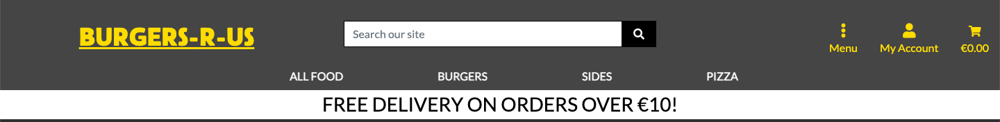

  - On desktop the navbar features the hero logo on the left, a product search bar in the centre, 2 dropdown icons on the right(menu and my account) and a cart icon with a live update total.
  When a user is logged in a logged in as: message is shown on the bottom right of the navbar
  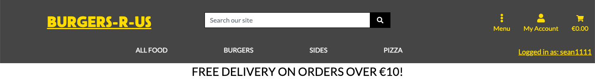

    - The menu icon when clicked dropsdown to reveal 3 links with icons. Reviews, contact us and home. The colours invert when hovered over.
          
    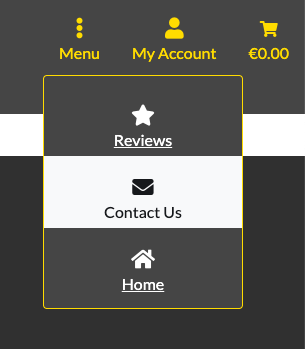

    - The my account icon when clicked dropsdown to reveal different links depending on user status.

      

Superuser Logged In

      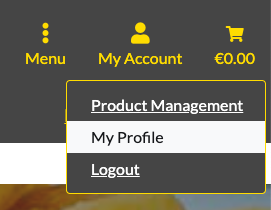
      

      

Regular user Logged In

      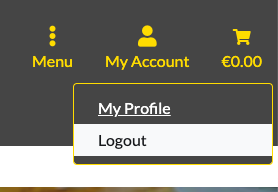
      

      

Logged Out

      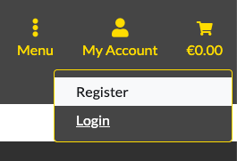
      

    - The navbar also features a main nav link for all products search 
      including different search filters by category and and all food search filter.
        
      

All Food dropdown

      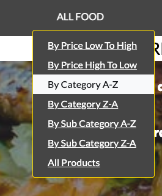
      

      

Burgers Dropdown

      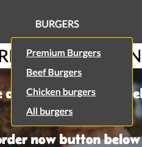
      

      

Sides Dropdown

      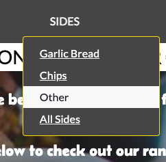
      

      

Pizza Dropdown

      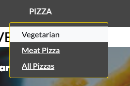
      

    - On the bottom of the navbar there is a delivery banner giving users information on how much they need to spend to get free delivery.

Navbar mobile

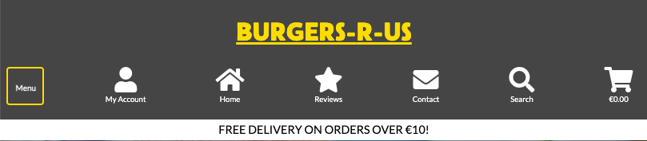

  - On mobile the layout of the navbar changes. The hero logo is centered at the top of the screen, all the icons are spread across the bottom and the main food search menu is transformed into an expandable hamburger menu. All of the dropdown icons remain the same.

  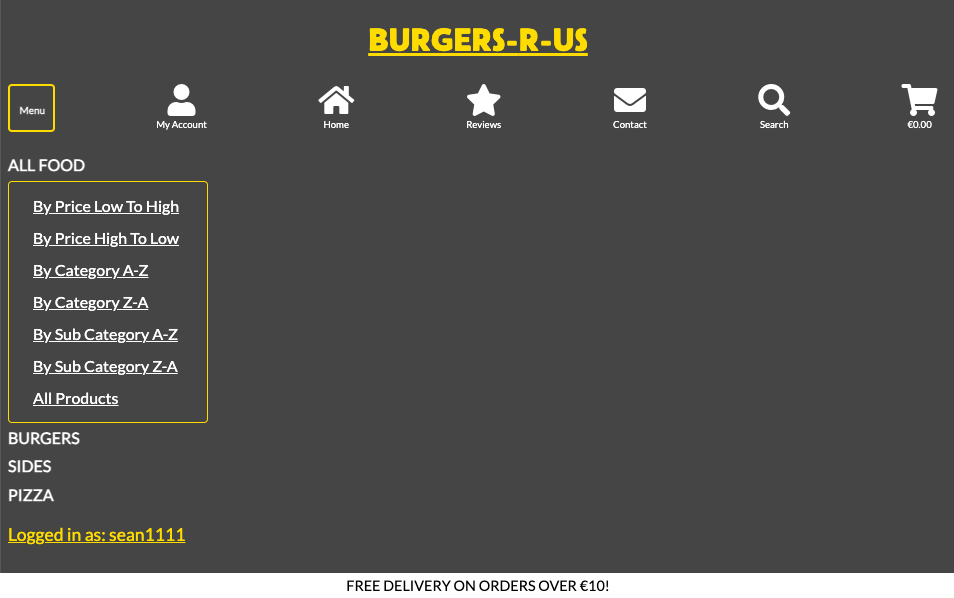

**Hero Image Section**

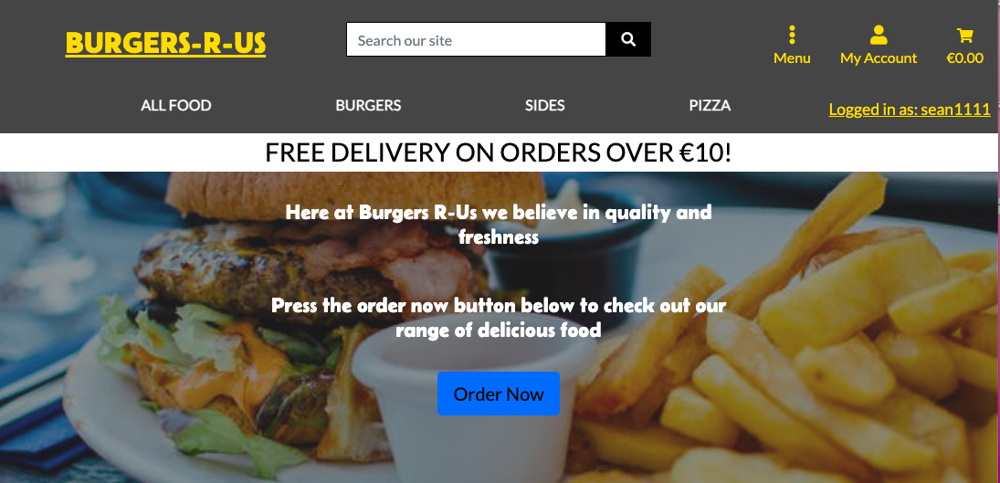

The Hero Image section lives just below the navbar on the homepage and features a background image with reduced opacity. It also features as small welcome message to the user and text telling them to press the order now button below to bring them to the products page.

**Opening Hours Section**

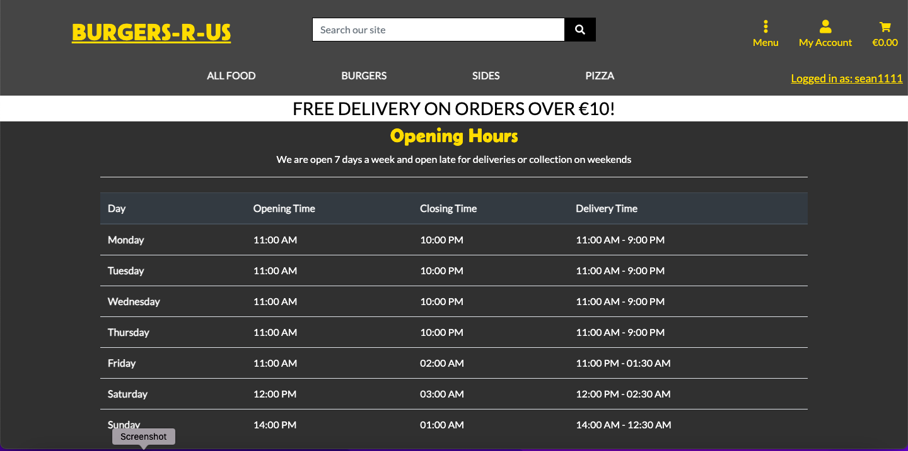

The opening hours section is just below the Hero image section and gives users a table of opening hours, closing hours and delivery times.

**Contact Us Section**

The Contact Us Section is just below the delivery times section and gives users info on how to contact the restaurant if they have an issue via both a phone number and a button. If the users click the Contact Us button they are brought to the contact page where they can fill out a form with there enquiry/issue.

**Review Section**

The review section is just below the contact us section and shows the users a button which brings them to the review page.

**Footer**

The footer lives at the bottom of the home page and contains 4 icon links to facebook, twitter, instagram and github. It also gives users the message that this site is a work of fiction and developer name and date.

#### **Products Page**

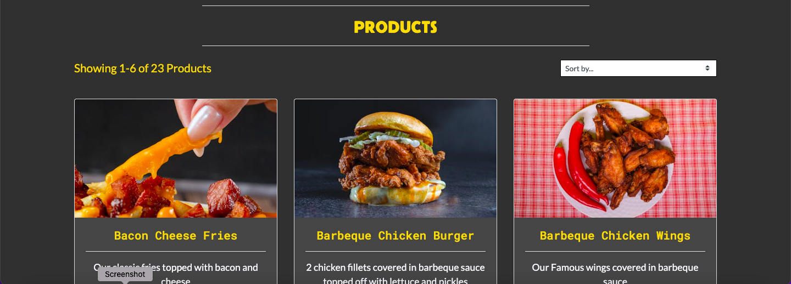

The products page is accessible via both the order now button on the homepage and the main nav menu in the navbar.

**Sorting, Filtering and Pagination**

The products page has a sorting feature where users can sort products by Price A-Z, Price Z-A, Name A-Z, Name Z-A, Category A-Z, Category Z-A, Sub-category A-Z and Sub-category Z-A. This feauture is found at the top right of the page.

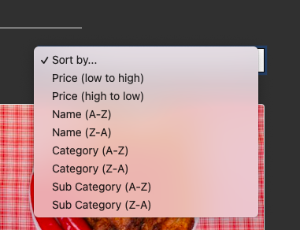

The users are also given info on how many products their search is returning. This info is shown on the top left of the screen.

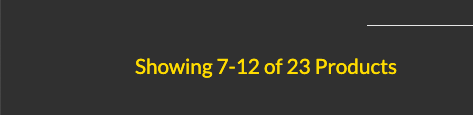

The product page also includes pagination with the users being shown how many pages of products in total their search is returning. This feature is at the bottom of the page. 6 products are shown per page.

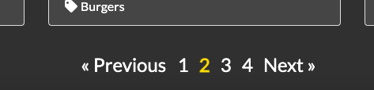

Users can filter their search for products by either the search bar in the navbar or the main nav menu

For example if the user types "pizza" into the search bar. The search will return all pizza products in the database.

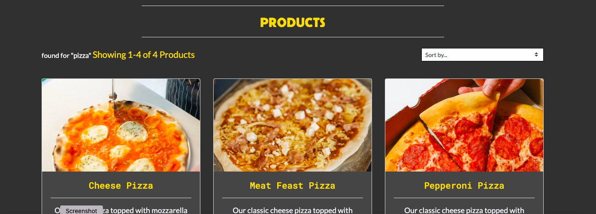

If the user enters a word into the search bar and no products are found they are shown an alert telling them that no products were found.

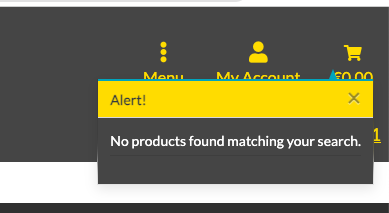

The filter feature from the main nav menu works similiar to the search bar. For example if the user clicks "All Burgers" from the filter menu they will only be shown burgers.

**Product Cards**

The product cards were designed using bootstrap cards and feauture the product image, name, description, contains, if vegetarian, if gluten free, price and a clickable category link which will bring users to a filtered product search of other products in that category.

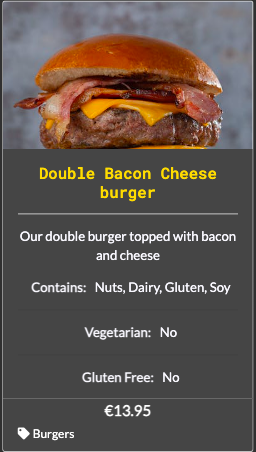

On large screens the cards stack 3 wide.

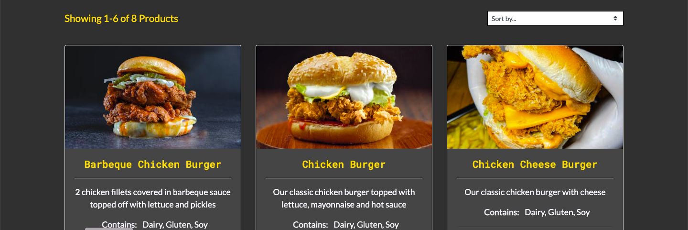

On medium screens 2 wide

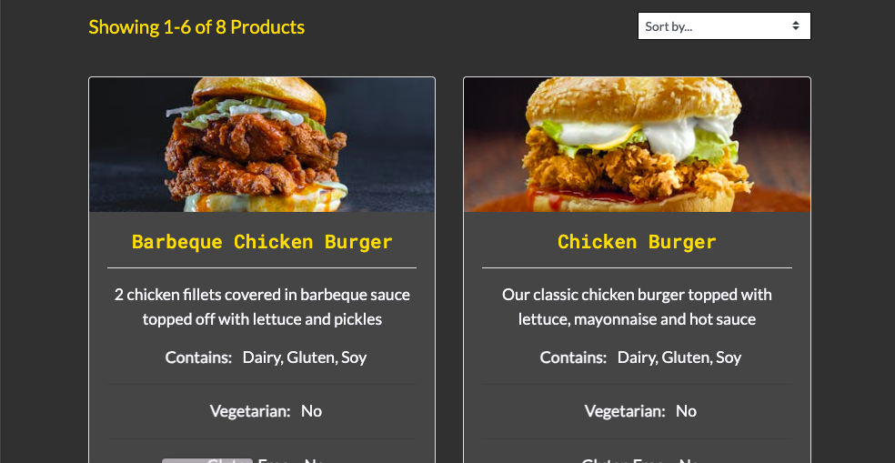

On small screens 1 wide

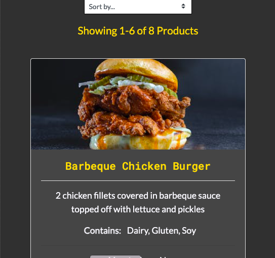

**Staff**

If a staff member is logged in they are shown 2 button at the bottom of the card to either edit or delete a product

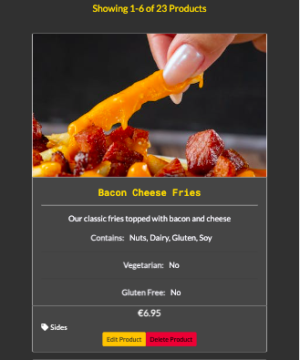

#### **Product Detail Page**

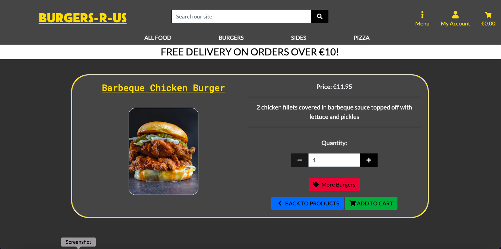

The Product Detail page is accessible by both clicking on the product image and the product name on the Products page.

On this page the users are shown the product name, image, price and description.

From here they can also add the product to their cart by selecting the quantity they want and pressing the add to cart button.

When users add a product to their cart they are shown an alert message giving them an overview of what product they just added to their cart, an overview of every product in their cart and their current order total

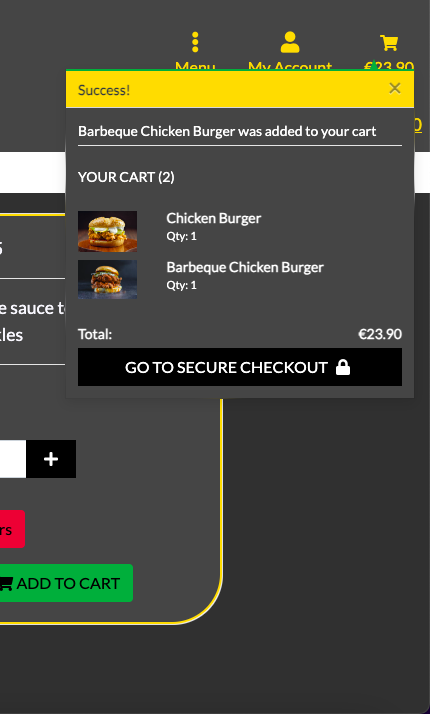

**Responsiveness**

On smaller screens the layout of the product detail card changes and the image centers on top with the rest of the details beneath.

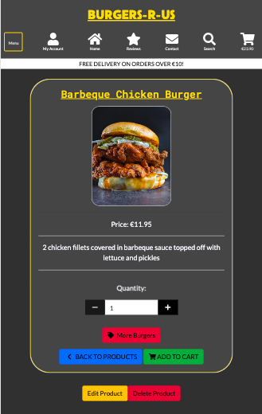

#### **Edit And Delete Product**

**Delete Product**

If a staff member clicks the delete product button they are shown a popup asking them if they are sure they want to delete the product. Only if they confirm delete from there the product is deleted. This feature is in place to handle misclicks or error.

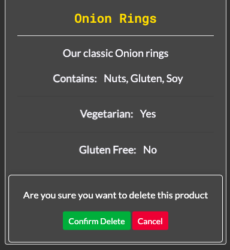

When the staff member confirms the deletion they are shown a success message telling the product was deleted. The product will be removed from the database after deletion.

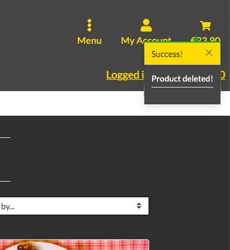

**Edit Product**

If the staff member clicks the edit product button they are brought to a form where they can edit the product details.

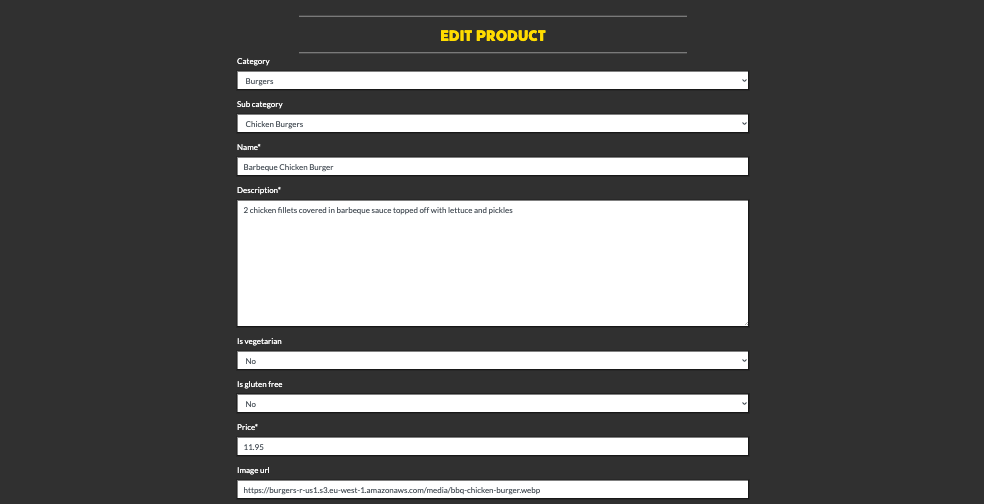
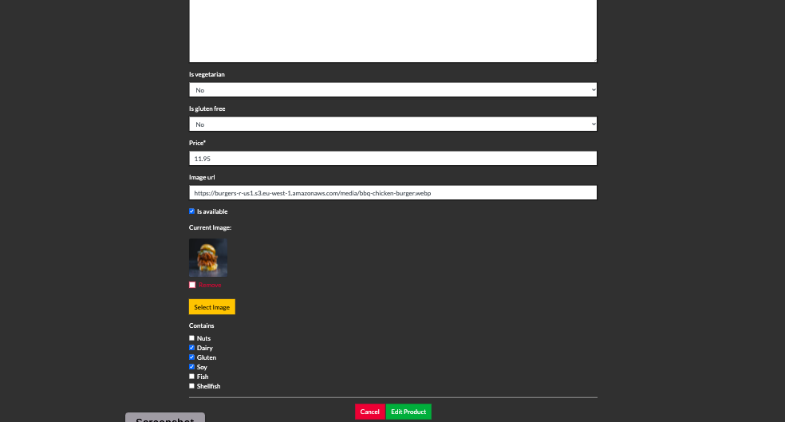

On entering the page they are shown an alert message telling them which product they are editing

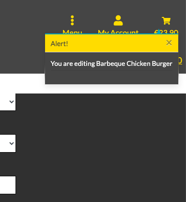

After editing the product they are redirected back to the products page and shown a success message

#### **Add Product Page**

Staff members can access the add product page by clicking the product management link in the my account dropdown menu on the navbar.
This option is only shown to users who have staff or superuser status

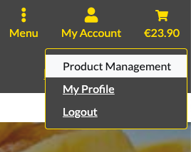

On clicking the link they are brought to a page which contains the form to add a product.

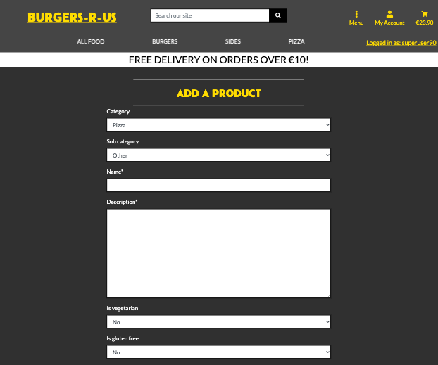
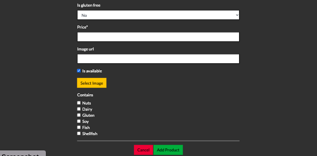

If a valid form is submitted a success message is shown telling the user that the product was successfully added and they are redirected back to the products page

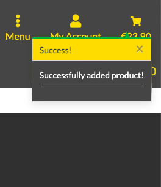

#### **Review Page**

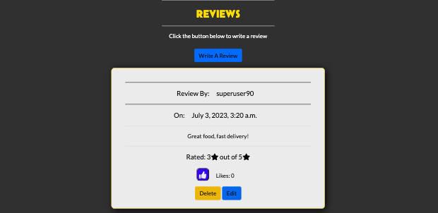

The review page is accessible via the menu dropdown on desktop

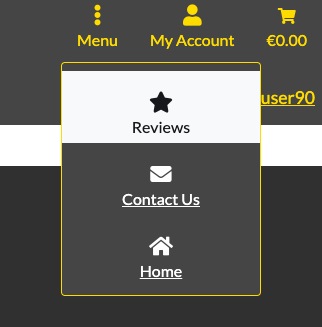

The review icon directly from the navbar on mobile

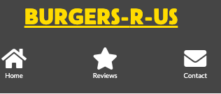

And the review section on the homepage

**Adding Reviews**

If users are logged in they are shown a write a review button on the top of the review page. Clicking this button will bring them to the add a review form where they can rate the service 1-5 and as there comment

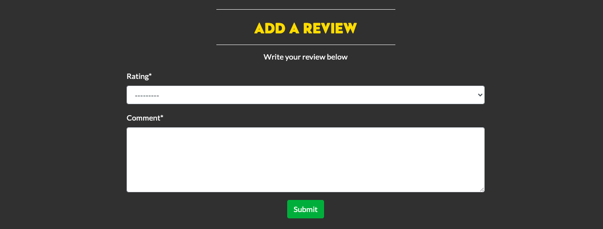

If the users submit a valid form they will be shown a success message and redirected back to the reviews page

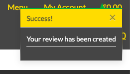

When a user has added their own review they are shown to buttons to either edit or delete their review if they wish.

**Deleting Reviews**

Pressing the delete button will show the user a confirmation message asking if they are sure they want to delete the review

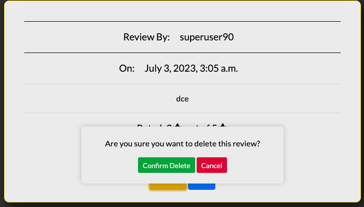

If the user confirms the delete they are shown a success message and redirected back to the review page

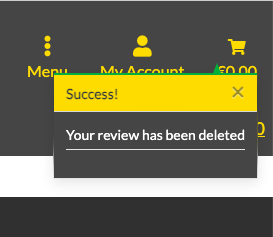

**Editing Reviews**

If the user presses the edit button they are shown an edit review form where they can edit details.

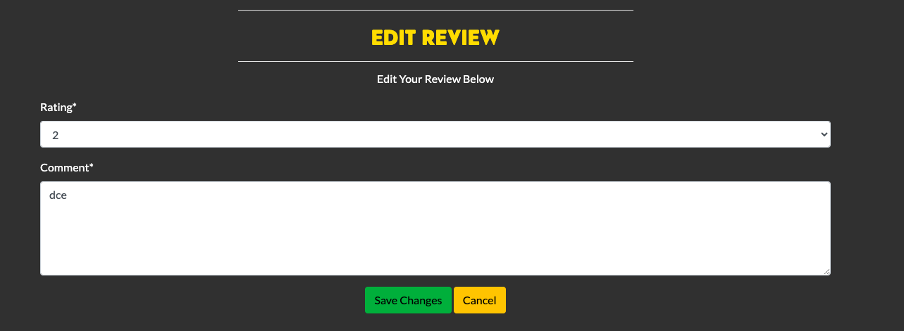

When the user has edited the form they are shown a success message and redirected back to the reviews page

**Liking Reviews**

Logged in users have the ability to like reviews by pressing the like button. The colour of the like button changes letting the user know if they have already liked the review or not

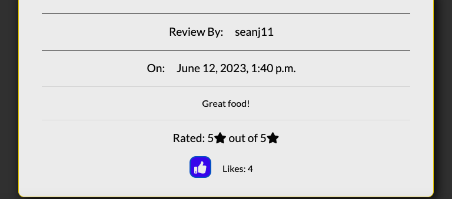
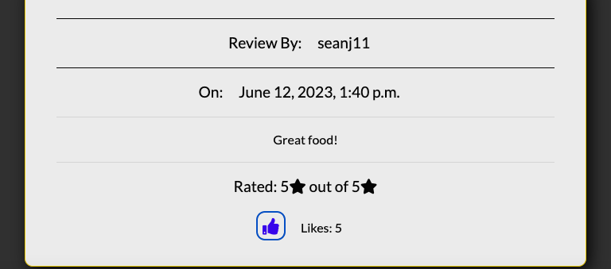

**Logged Out Users**

Logged out users can still access the reviews page and read reviews but they will be unable to write a review unless they are logged in. Instead of the write review button users are shown a message telling them they need to log in and links to both the login and signup pages

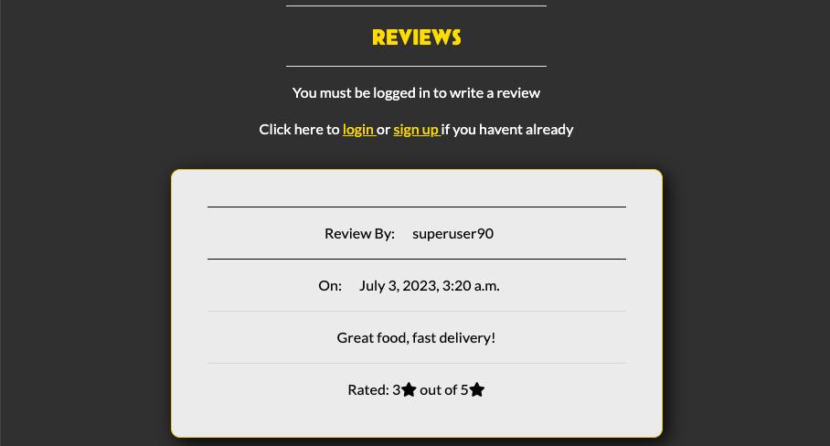

#### **Contact Page**

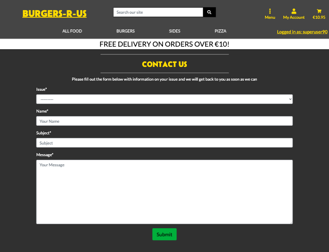

The contact page is accessible via the menu dropdown on desktop

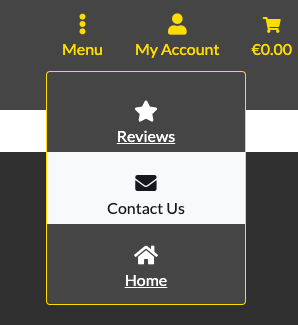

And the contact icon on the navbar on mobile

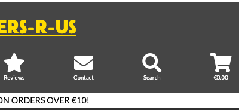

The contact page is only accessible to logged in users. This feature is in place to prevent spam. If a logged out user tries to access the contact page they are redirected to the sign in page.

When users click the contact us link they are shown a form where they can select their issue from a dropdown, enter their full name, subject and message.

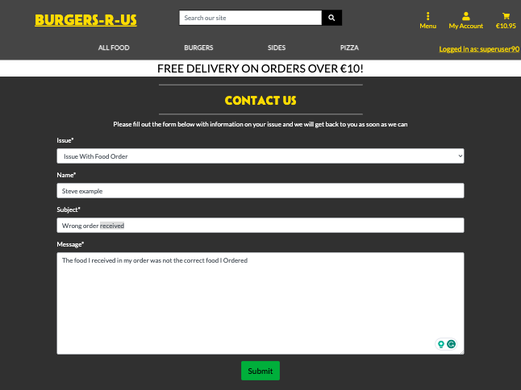

On valid form submission the user is brought to the contact success page showing them a message telling them their enquiry has been received and they should receive an email shortly. The user can return to the home page from this page by pressing the home button

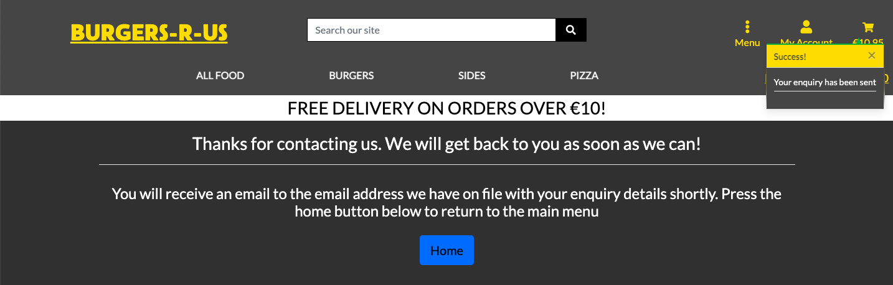

The users log in and email are used as default info for the contact form so the user will receive a confirmation email to the email address they signed upto the site with

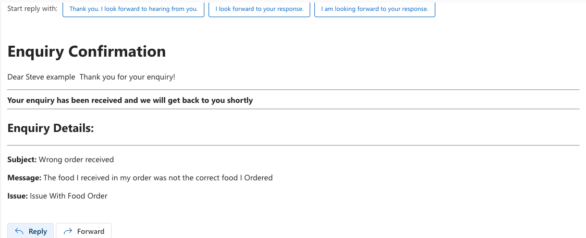

#### **Profile Page**

The profile page is accessible to logged in users via the my account dropdown on the navbar

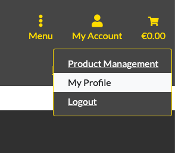

Here users can update their default delivery info and view their order history.

On valid form submission the users default info will be updated and they will be shown a success message telling them their profile was updated.

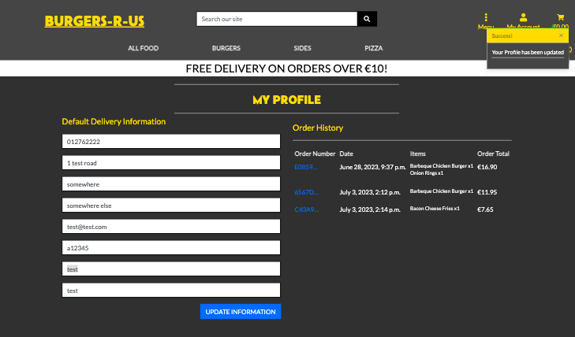

This info will now be pre rendered into the form when a user wants to checkout.

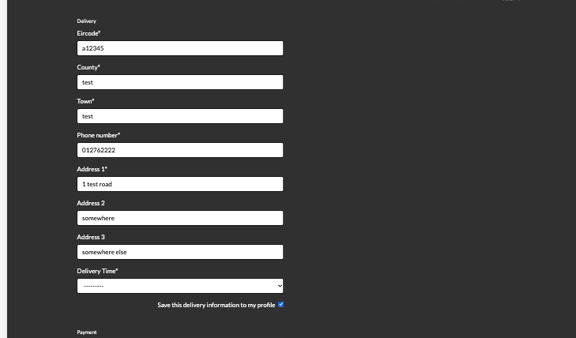

**Order History**

Users can view their order history by clicking on the order number in the order history section.

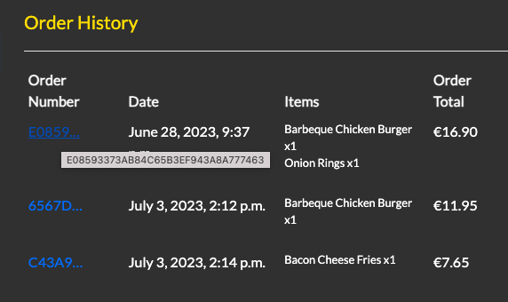

From there they will be brought to the order history page where they can view the details of the order that they have clicked on.
They will also be shown an alert message telling them that this is a past comfirmation and they have received an email with the order details.

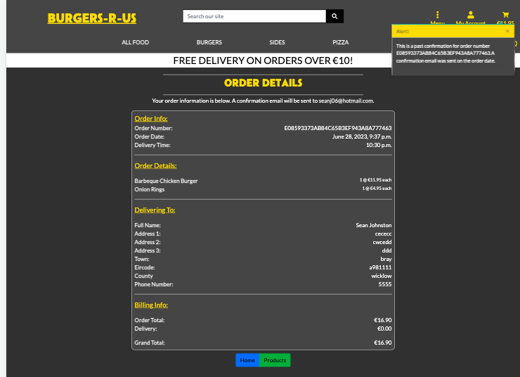

#### **Cart**

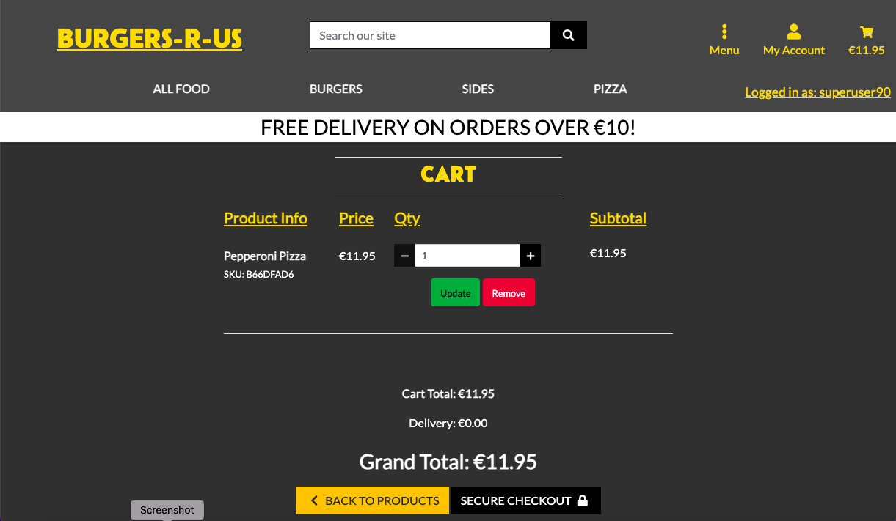

The cart page is accessbile via the navbar icon which also shows a live view of the cart total

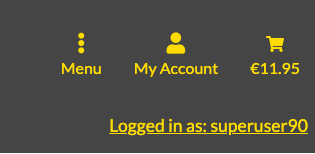

From here the user can View all the current products in their cart, view their current order total, update the total quantity of each product and remove products.

If the user updates the quantity of a product in their cart they are shown a success message telling them the quantity of item was updated.

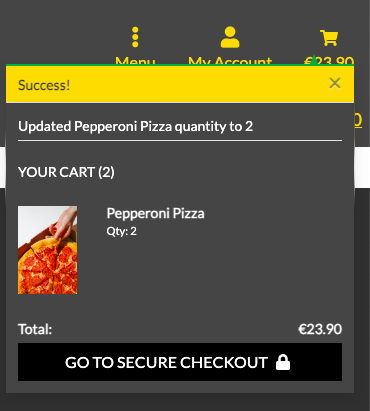

If the user removes a product from their cart they are shown a success message telling them which product was removed

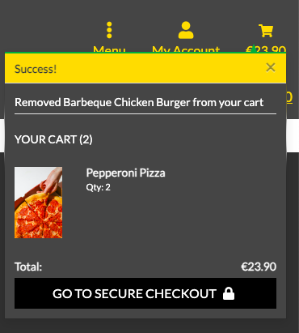

Users are also shown 2 buttons at the bottom of the cart page. 1 to go back to products and 1 to proceed and checkout.

#### **Checkout Page**

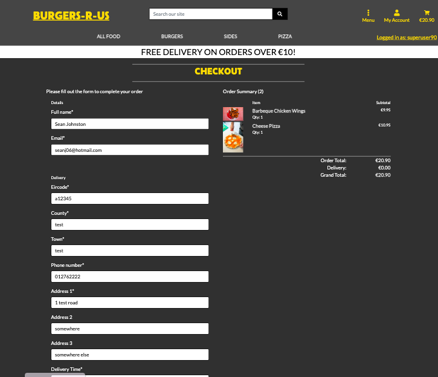
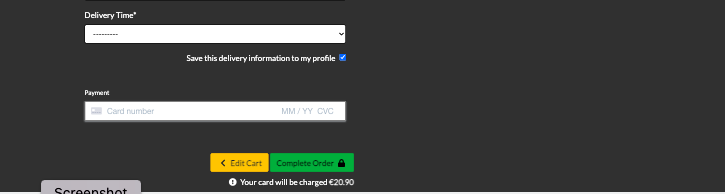

The checkout page is accessible after A user clicks the checkout securely button from the cart page.

From there they are brought to the checkout page which includes a form for users to enter their name and email, delivery info and card info.

If the user has updated their default delivery info on the profile page the form will be pre populated with the info they have entered.

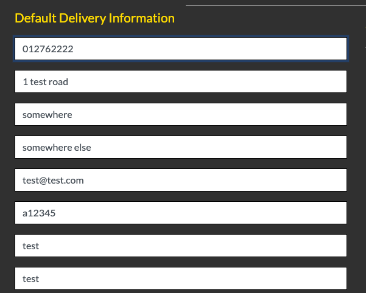
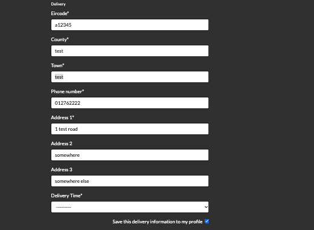

The user is also shown a checkout order summary which includes all products they are checking out, their quantity, total for each product, order total, delivery total and grand total

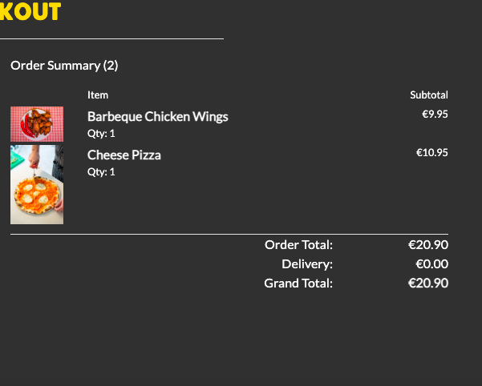

**Dynamic Delivery times**

One of the features of the checkout page is the dynamic delivery time slots. The user is able to choose delivery times based off the current time and a 30 minute delay.

For example if the day is Monday the delivery time hours are 11:00 AM - 21:00 PM. So if the user makes an order at 16:30 on Monday the delivery times that will be shown to them will be 17:00 - 21:00 in 15 minute increments.

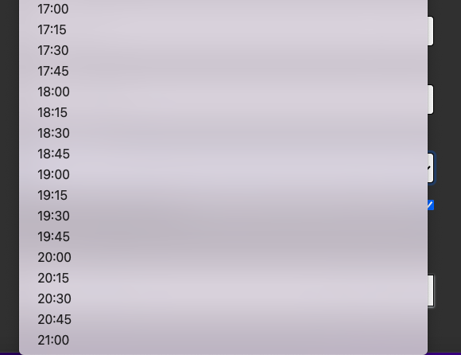

These times vary per day. For example delivery times on Friday, Saturday and Sunday are much later so the user will have the option of choosing later delivery times.

If the user tries to checkout outside of delivery times the checkout form doesnt render and they are shown the delivery service closed page

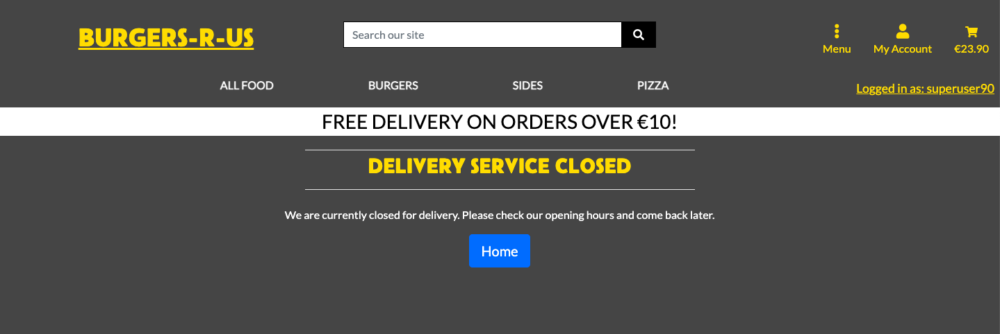

One of the features I originally intended to implement was to let users order for the next day but due to time constraints this could not be completed. This will be discussed more in the future features section of the ReadMe.

**Successful Checkout**

If the form is valid the users will be shown a loading spinner while the order is processing

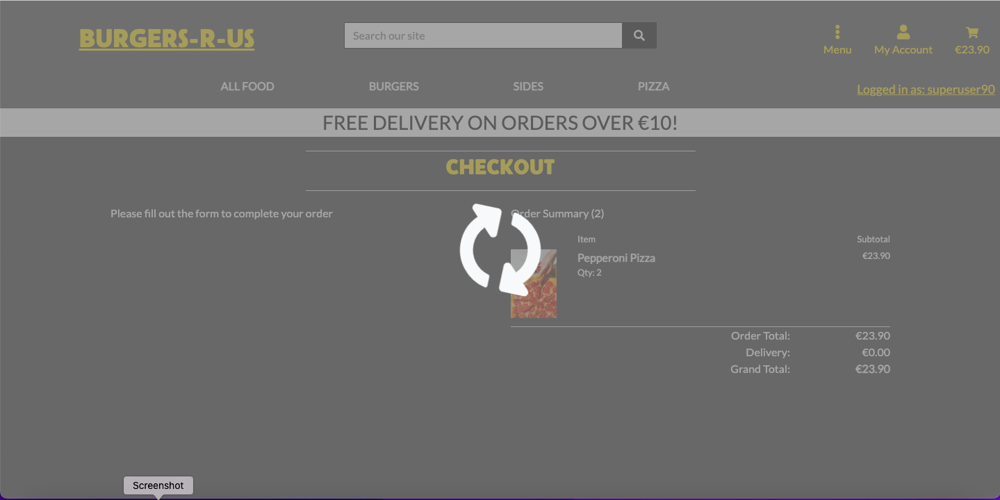

After the order is processed the user is redirected to the checkout success page with their order details and a success message telling them their order number and their order details have been emailed to them.

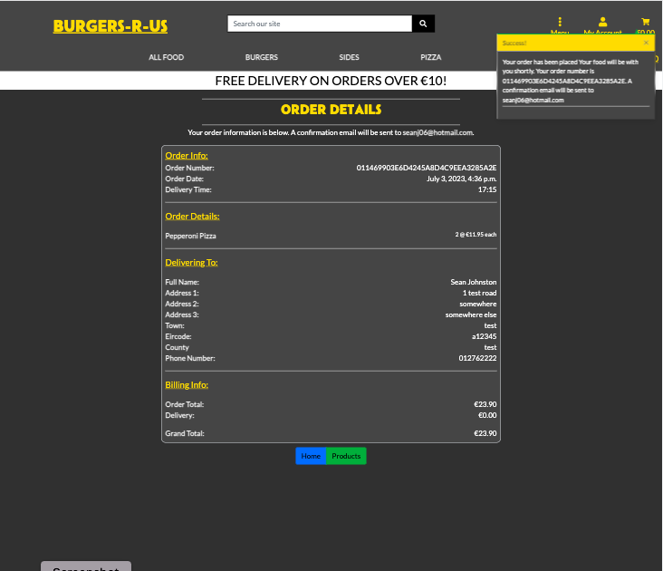

The user will receive an email to their entered email address with all of the order info.

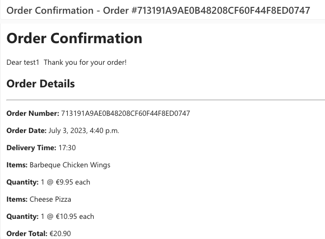
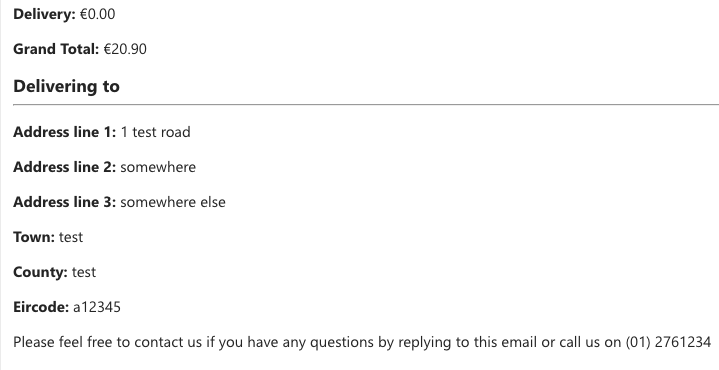

**Stripe**

All of the card payment elements on the checkout form are handled by Stripe Test account

#### **Login, Logout And Register Pages**

All of the user login, logout and Register pages on the site are handled by allauth and styled using crispyforms.

**Register**

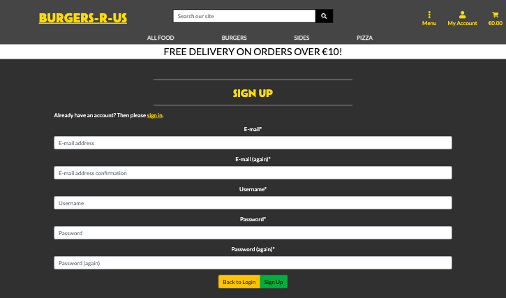

The register page can be accessed via the my account icon in the navbar if the user is logged out.

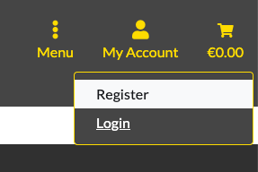

From here the user is shown a form to enter their email, username and password to sign up for an account.

On valid form subission the user is brought to the verify email page telling them an email has been sent to the given email address and it needs to be verified. Ony when the user verifies their email they will be able to sign in.

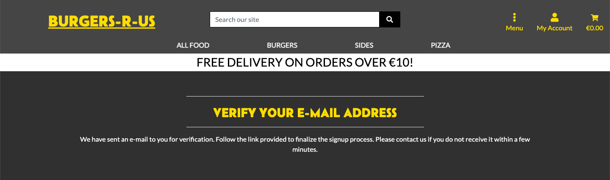

**Login**

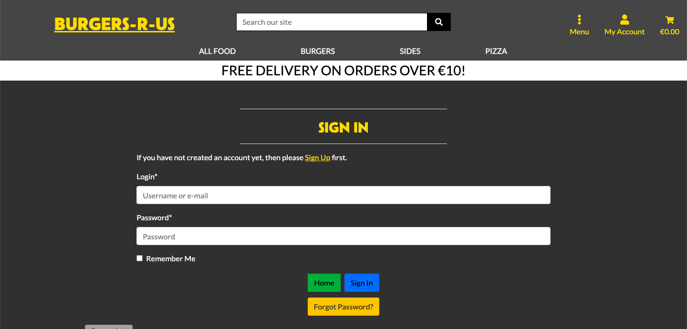

The login page is accessible via the my account icon in the navbar if the user is logged out

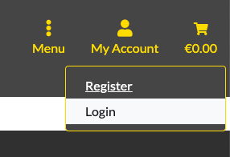

From here the user is brought to the login page where they can enter their email or username and their password.

They also have the option to check the remember me box for the site to remember their details next time they sign in.

If the user enters valid login details they will be logged in, shown a success message and redirected to the home page.

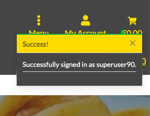

If the user presses the reset password button they will be redirected to the rest password page where they will be prompted to enter their email address to reset their password.

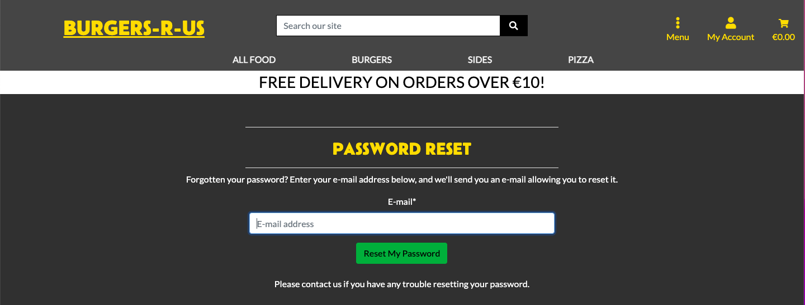

Once the user enters their email address they will be redirected to the password reset done page telling them which steps to follow next

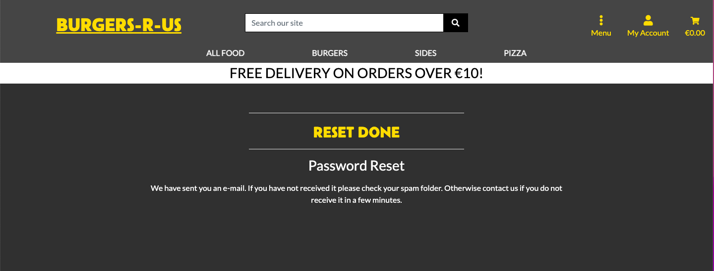

**Logout**

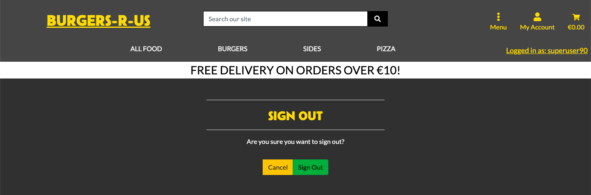

The logout page is accessible from the my account icon on the navbar if the user is logged in.

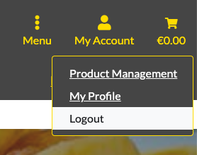

From here the user is brought to the logout page where they are shown a message asking them if they are sure they want to sign out.

If the user presses the cancel button they are redirected back to the home page and if the user presses the sign out button they are logged out, shown a success message and redirected back to the home page.

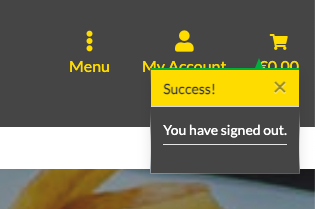

#### **Custom Error pages**

Custom Error 404, 403 and 500 error pages were made to match the theme of the rest of the site

**404 Page Not Found**

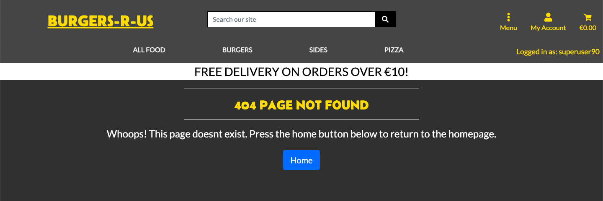

**500 Internal Server Error**

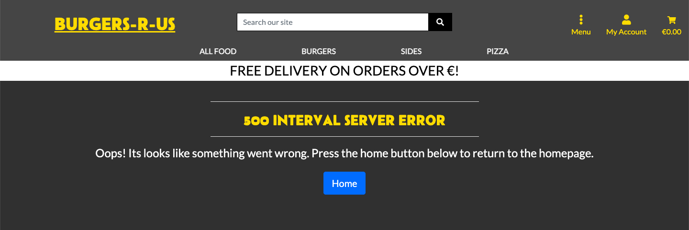

**403 Action Forbidden**

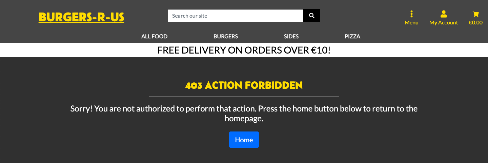

#### **Favicon**

A custom favicon was built for the site which is A gold yellow B on with a dark gray background which matches the theme of the site.

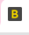

The favicon was built on [favicon.io](https://favicon.io/favicon-generator/)

### **Future Features**

#### **Special offers page**

One feature that was originally meant to be implemented into the site but couldnt because of time constraints is the special offers page. This would be a page that users can navigate to to view special offers on products including meal deals.

#### **Next Day Delivery**

Another feature that I would like to be implemented in the future is the option for users to be able to choose next day delivery if they try to order outside of the current delivery hours. Again because of time constraints this feature could not be added.

#### ***Admin Order tracker**

Another feature I would like to implement in the future is an in site order tracker for management to view all orders for the day including total revenue.

#### ***Customising Food**

The ability for users to customise the food they are ordering is another feature I would like to implement in the future.

