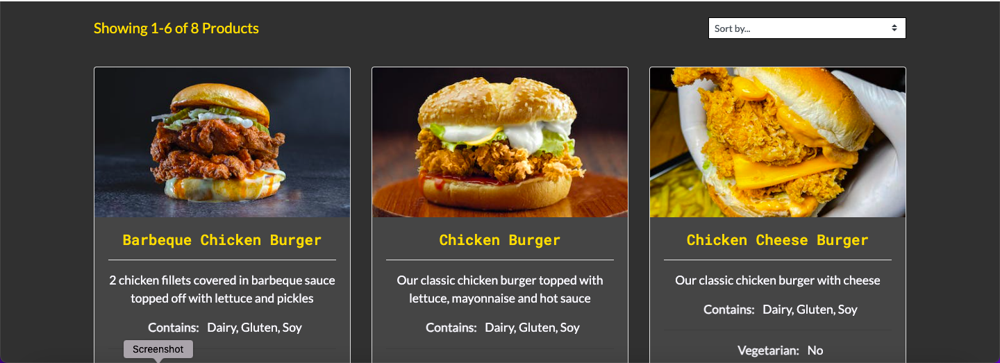
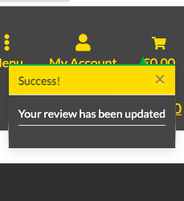
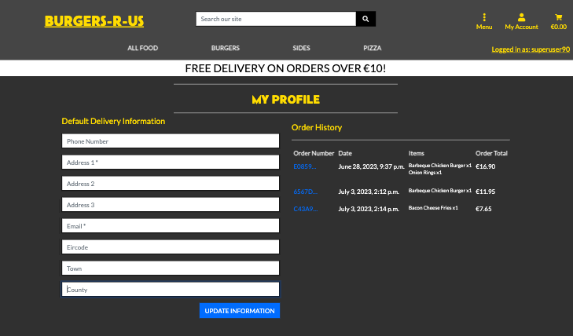
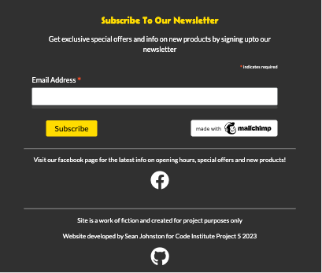
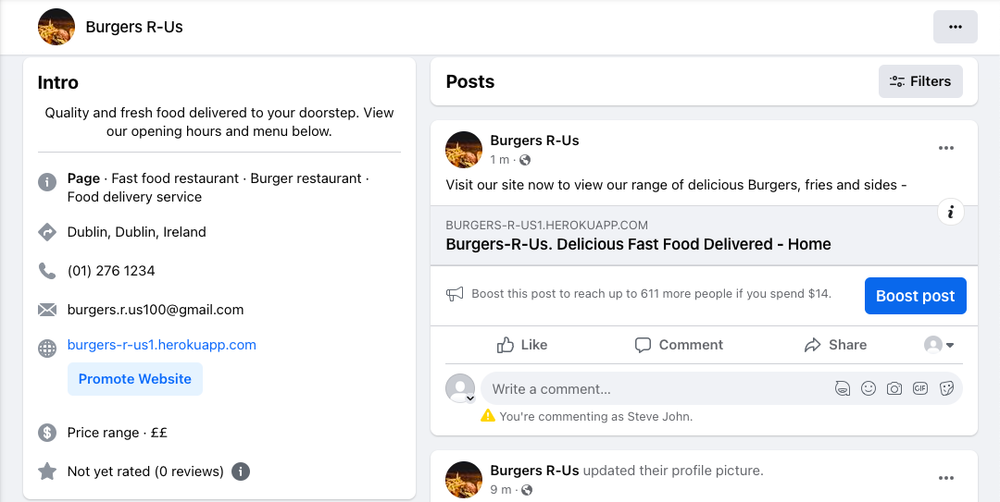

# **Burgers R-Us**

## **Overview**

Burgers R-Us is a local takeaway e-commerce site that specialises in Burgers and Fries. Users are able to add Products to the cart and checkout securely
via stripe whether they are signed in or not. If users sign up for an account they unlock more features such as saving  default delivery info, being able
to contact the site with any issues or queries and writing and liking reviews.

Other features of the site include users being able to searh for products via a search bar, a product filter search by category, sub category and being 
able to sort products by a wide range of different filters.

Developed by Sean Johnston for code institute Project Portfolio project 5.

Link to the live site : [Burgers R-Us](https://burgers-r-us1.herokuapp.com/)

## **Contents**

1. [Overview](#overview)
2. [Project Goals](#project-goals)
3. [U/X](#ux)
    - [The Strategy Plane](#the-strategy-plane)
      - [Target Users](#target-users)
      - [Site Goals](#site-goals)
    - [The Scope Plane](#the-scope-plane) 
    - [Agile Planning](#agile-planning)  
      - [Epics](#epics)
    - [The Structure Plane](#the-structure-plane) 
    - [The Skeleton Plane](#the-skeleton-plane)  
      - [Wireframes](#wireframes)
      - [Database Schema](#database-schema)
    - [The Structure Plane](#the-structure-plane)  
      - [Features](#features)
        - [Home Page](#home-page)
        - [Products Page](#product-page)
        - [Product Detail Page](#product-detail-page)
        - [Add Product Page](#add-product-page)
        - [Review Page](#review-page)
        - [Contact Page](#contact-page)
        - [Profile Page](#profile-page)
        - [Cart Page](#cart)
        - [Checkout Page](#checkout-page)
        - [Footer](#footer)
        - [Allauth Pages](#login-logout-and-register-pages)
        - [Custom Error Pages](#custom-error-pages)
        - [Favicon](#favicon)
      - [Future Features](#future-features)  
    - [The Surface Plane](#the-surface-plane)  
      - [Design](#design)   
          - [Colour Scheme](#colour-scheme)
          - [Typography](#typography)
          - [Imagery](#imagery)
4. [Ecommerce Business Model](#ecommerce-business-model)
5. [Marketing Strategy](#marketing-strategy)    
    - [Social Media Marketing](#social-media-marketing)  
    - [Newsletter](#newsletter)    
6. [SEO](#search-engine-optimization-seo)  
    - [Keywords](#keywords)  
    - [Page Titles](#page-titles)  
    - [Sitemap](#sitemapxml)
    - [Robots.txt](#robotstxt)
7. [Technologies Used](#technologies-used) 
    - [Languages Used](#languages-used)  
    - [Frameworks Used](#frameworks-used) 
    - [Other Technologies Used](#other-technologies-used)
    - [Libraries Used](#libraries-used)
8. [Testing](#testing)    
9. [Deployment](#deployment) 
10. [Credits](#credits)
    - [Project Setup And Github Template](#project-set-up-and-github-template)
    - [Media And Content](#media-and-content)
    - [Code And Issues](#code-and-issues)
    - [Unit Testing](#unit-testing)
11. [Acknowledgements](#acknowledgements) 

## **Project Goals**

As my fifth project for the [Code Institute](https://codeinstitute.net/) 5P course, the goal of the project is to demonstrate all of the skills I have learned in the course so far including languages such as HTML, CSS, Javascript and Python. Frameworks such as Django and Bootstrap and version control technologies such as Git and Github.

[Top of page &uarr;](#contents)

## **UX**

## **The Strategy Plane**

Burgers R-Us is an e-commerce site for a local takeaway which is designed to be easy for users to find products, add them into their cart, securely checkout
and enter their delivery details.

Registered users will be able to contact the site owners about any enquiries or issues, save default delivery info and write and like reviews.
Users with Staff status will be able to add, edit or delete products from the site aswell as the admin area.

The design of the overall site is aimed to be eye catching for the users and easy on the eye with a darker theme rather than light.

### **Target Users**

- A user looking to order a takeaway online
- A user who likes to read/add reviews about food
- A user who likes the convenience of being able to save default delivery info to their profile
- A user who likes using a recognisable secure checkout method(stripe)

### **Site Goals**

- To provide users with the ability to order food for delivery online
- To provide users with the ability to make an account to save their details
- To provide users with the ability to write/like reviews
- To provide users with the ability to contact the site owners about any issues or queries
- To provide users with the ability to search fro different products in a wide variety of different ways.

[Top of page &uarr;](#contents)

## **The Scope Plane**

- CRUD Ability for authenticated users on Reviews and profile info
- CRUD Ability for both authenticated and non authenticated users on cart
- Restricted site features for authenticated and non-authenticated users such as adding and liking reviews, saving profile info and contact section.
- Restricted site features for staff such as adding, editing and deleting products.
- Full responsiveness for all screen sizes down to 320px including different navbar layout for medium to small screens.

[Top of page &uarr;](#contents)

## **Agile Planning**

This project was built using the Agile method throughout by creating EPIC Milestones which were broken down into smaller user stories with labels "must-have", "should-have", "could-have", and wont have. 

Epics milestones were given Acceptance criteria and the must haves were completed first to complete the milestone. Any user stories that were not completed were moved back into the project backlog.

The Kanban board was created using Github projects and can be located [here]()  and can be viewed to see the completed and backlogged user stories.

### **Epics**

Epics were broken down into 13 EPIC Milestones(including backlog)
which includes 56 user stories in total. Each Milestone was closed when all the criteria had been met / all user stories were completed.
User stories were given tasks, and when each task and the given user stories were completed a comment was left with the commit number underneath the user story. When all tasks were complete the user story was closed.
All user stories attached to the milestones will be tested in the testing user stories section of testing.md

#### **EPIC: Django Installation and app setup [Milestone #1](https://github.com/seanj06/Burgers-R-Us-P5/milestone/1)**

This Epic had 3 user stories attached and was the first to be completed 
due to it being needed for the project work to start

1. **[USER STORY: Create Django Project And App #3](https://github.com/seanj06/Burgers-R-Us-P5/issues/3)**

2. **[USER STORY: Install Django and relevant libraries #2](https://github.com/seanj06/Burgers-R-Us-P5/issues/2)**

3. **[USER STORY: Create Superuser #1](https://github.com/seanj06/Burgers-R-Us-P5/issues/1)**

#### **EPIC: First Heroku Deployment [Milestone #2](https://github.com/seanj06/Burgers-R-Us-P5/milestone/2)**

This Epic had 2 user stories attached and involved setting up heroku and aws bucket for deployment

1. **[USER STORY: Static File Hosting #8](https://github.com/seanj06/Burgers-R-Us-P5/issues/8)**

2. **[USER STORY: Create new Heroku app #7](https://github.com/seanj06/Burgers-R-Us-P5/issues/7)**

#### **EPIC: Allauth Installation And Setup [Milestone #3](https://github.com/seanj06/Burgers-R-Us-P5/milestone/9)**

This Epic had 4 user stories attached and involved setting up allauth, customising allauth templates and setting up emails.

1. **[USER STORY: Install Allauth #4](https://github.com/seanj06/Burgers-R-Us-P5/issues/4)**

2. **[USER STORY: Customise Allauth templates #10](https://github.com/seanj06/Burgers-R-Us-P5/issues/10)**

3. **[USER STORY: Sign Up/Sign In/ Sign out #5](https://github.com/seanj06/Burgers-R-Us-P5/issues/5)**

4. **[USER STORY: Email Verification #6](https://github.com/seanj06/Burgers-R-Us-P5/issues/6)**

#### **EPIC: User Checkout [Milestone #4](https://github.com/seanj06/Burgers-R-Us-P5/milestone/12?closed=1)**

This Epic had 3 user stories attached and involved setting up the checkout models, templates and forms.

1. **[USER STORY: Checkout Models #26](https://github.com/seanj06/Burgers-R-Us-P5/issues/26)**

2. **[USER STORY: Checkout Form #28](https://github.com/seanj06/Burgers-R-Us-P5/issues/28)**

3. **[USER STORY: Checkout Template #27](https://github.com/seanj06/Burgers-R-Us-P5/issues/27)**

#### **EPIC: User profile [Milestone #5](https://github.com/seanj06/Burgers-R-Us-P5/milestone/5?closed=1)**

This Epic had 5 user stories attached and involved setting up the profile models, view app and order history

1. **[USER STORY: Profile app #32](https://github.com/seanj06/Burgers-R-Us-P5/issues/32)**

2. **[USER STORY: Profile Model #33](https://github.com/seanj06/Burgers-R-Us-P5/issues/33)**

3. **[USER STORY: Profile View #34](https://github.com/seanj06/Burgers-R-Us-P5/issues/34)**

4. **[USER STORY: Default form info #36](https://github.com/seanj06/Burgers-R-Us-P5/issues/36)**

5. **[USER STORY: Order History #35](https://github.com/seanj06/Burgers-R-Us-P5/issues/35)**

[Top of page &uarr;](#contents)

#### **EPIC: Home page creation [Milestone #6](https://github.com/seanj06/Burgers-R-Us-P5/milestone/4)**

This Epic had 5 user stories attached and involved setting up the navbar, search functionality and styling for the home page

1. **[USER STORY: Navbar creation #11](https://github.com/seanj06/Burgers-R-Us-P5/issues/11)**

2. **[USER STORY: Search functionality #17](https://github.com/seanj06/Burgers-R-Us-P5/issues/17)**

3. **[USER STORY: Hero Image #12](https://github.com/seanj06/Burgers-R-Us-P5/issues/12)**

4. **[USER STORY: Home page styling #18](https://github.com/seanj06/Burgers-R-Us-P5/issues/18)**

5. **[USER STORY: Contact Form #37](https://github.com/seanj06/Burgers-R-Us-P5/issues/37)**

#### **EPIC: Stripe Setup [Milestone #7](https://github.com/seanj06/Burgers-R-Us-P5/milestone/6?closed=1)**

This Epic had 4 user stories attached and involved setting up stripe on both the code and on Heroku

1. **[USER STORY: Checkout Success #30](https://github.com/seanj06/Burgers-R-Us-P5/issues/30)**

2. **[USER STORY: Render Stripe Field To Template #29](https://github.com/seanj06/Burgers-R-Us-P5/issues/29)**

3. **[USER STORY: Heroku stripe setup #9](https://github.com/seanj06/Burgers-R-Us-P5/issues/9)**

4. **[USER STORY: Webhooks #31](https://github.com/seanj06/Burgers-R-Us-P5/issues/31)**

#### **EPIC: Crud Functionality [Milestone #8](https://github.com/seanj06/Burgers-R-Us-P5/milestone/8)**

This Epic had 11 user stories attached and involved all crud functionality across the site for both staff and users.

1. **[USER STORY: Add Product To Cart #13](https://github.com/seanj06/Burgers-R-Us-P5/issues/13)**

2. **[USER STORY: Edit quantity in cart #15](https://github.com/seanj06/Burgers-R-Us-P5/issues/15)**

3. **[USER STORY: Remove item from cart #14](https://github.com/seanj06/Burgers-R-Us-P5/issues/14)**

4. **[USER STORY: Create a review #38](https://github.com/seanj06/Burgers-R-Us-P5/issues/38)**

5. **[USER STORY: Read A Review #39](https://github.com/seanj06/Burgers-R-Us-P5/issues/39)**

6. **[USER STORY: Update Review #40](https://github.com/seanj06/Burgers-R-Us-P5/issues/40)**

7. **[USER STORY: Delete Review #41](https://github.com/seanj06/Burgers-R-Us-P5/issues/41)**

8. **[USER STORY: Add Products to site #42](https://github.com/seanj06/Burgers-R-Us-P5/issues/42)**

9. **[USER STORY: Edit Product #43](https://github.com/seanj06/Burgers-R-Us-P5/issues/43)**

10. **[USER STORY: Delete Products #44](https://github.com/seanj06/Burgers-R-Us-P5/issues/44)**

11. **[USER STORY: View Items in cart #16](https://github.com/seanj06/Burgers-R-Us-P5/issues/16)**

[Top of page &uarr;](#contents)

#### **EPIC: U/X [Milestone #9](https://github.com/seanj06/Burgers-R-Us-P5/milestone/14)**

This Epic had 6 user stories attached and involved finishing off the styling of pages for u/x

1. **[USER STORY: User Notifications #25](https://github.com/seanj06/Burgers-R-Us-P5/issues/25)**

2. **[USER STORY: Finish styling cart page #46](https://github.com/seanj06/Burgers-R-Us-P5/issues/46)**

3. **[USER STORY: Finish styling home page #45](https://github.com/seanj06/Burgers-R-Us-P5/issues/45)**

4. **[USER STORY: Finish stying product pages #48](https://github.com/seanj06/Burgers-R-Us-P5/issues/48)**

5. **[USER STORY: Finish styling allauth pages #47](https://github.com/seanj06/Burgers-R-Us-P5/issues/47)**

6. **[USER STORY: Custom Error Pages #49](https://github.com/seanj06/Burgers-R-Us-P5/issues/49)**

#### **EPIC: SEO [Milestone #10](https://github.com/seanj06/Burgers-R-Us-P5/milestone/10?closed=1)**

This Epic had 3 user stories attached and involved SEO optimization

1. **[USER STORY: Seo implementation #50](https://github.com/seanj06/Burgers-R-Us-P5/issues/50)**

2. **[USER STORY: XML sitemap #51](https://github.com/seanj06/Burgers-R-Us-P5/issues/51)**

3. **[USER STORY: Robots.txt file #52](https://github.com/seanj06/Burgers-R-Us-P5/issues/52)**

[Top of page &uarr;](#contents)

#### **EPIC: Product Page [Milestone #11](https://github.com/seanj06/Burgers-R-Us-P5/milestone/13?closed=1)**

This Epic had 5 user stories attached and invloved the creation of the product page and search and filter functionality.

1. **[USER STORY: View Products #20](https://github.com/seanj06/Burgers-R-Us-P5/issues/20)**

2. **[USER STORY: Individual Product Details #21](https://github.com/seanj06/Burgers-R-Us-P5/issues/21)**

3. **[USER STORY: Filter Product By Category #23](https://github.com/seanj06/Burgers-R-Us-P5/issues/23)**

4. **[USER STORY: Sort Food Products #24](https://github.com/seanj06/Burgers-R-Us-P5/issues/24)**

5. **[USER STORY: Product page creation #19](https://github.com/seanj06/Burgers-R-Us-P5/issues/19)**

#### **EPIC: Testing [Milestone #12](https://github.com/seanj06/Burgers-R-Us-P5/milestone/16)**

This Epic had 4 user stories and involved all testing including automated testing, manual testing, code validation and lighthouse testing

1. **[USER STORY: Python Automated testing #53](https://github.com/seanj06/Burgers-R-Us-P5/issues/53)**

2. **[USER STORY: Lighthouse testing #56](https://github.com/seanj06/Burgers-R-Us-P5/issues/56)**

3. **[USER STORY: Code validation #55](https://github.com/seanj06/Burgers-R-Us-P5/issues/55)**

4. **[USER STORY: Python manual testing #54](https://github.com/seanj06/Burgers-R-Us-P5/issues/54)**

#### **[Backlog](Backlog)**

The backlog currently has 1 unfinished user story in it. Products special offer page which was not completed due to time constraints. This will be discussed further in the testing user stories section

1.**[USER STORY: Product Special Offers page #22](https://github.com/seanj06/Burgers-R-Us-P5/issues/22)**

[Top of page &uarr;](#contents)

## **The Skeleton Plane**

### **Wireframes**

Wireframes for the project were created on [Balsamiq](https://www.googleadservices.com/pagead/aclk?sa=L&ai=DChcSEwipl_y6tPX_AhWS7O0KHQjIA1sYABAAGgJkZw&ohost=www.google.com&cid=CAESbeD2ccqo8oDlzHFF4zbaV7KGAZVuaGnNBdddD_bCzQRZZXG89KOq1bR5tTzAGzFw9lulTUQrVzvNb-h1Y0Evgoy9Vysb07io1aY714qDyozR72dg5MUYiTf0U90m5Jtk84vM2qp4g1XZVs8MLGU&sig=AOD64_0cWpzV5GO3p3y1kmK1V2EAh6oj0w&q&adurl&ved=2ahUKEwjlh_a6tPX_AhWYiFwKHTr7DXQQ0Qx6BAgIEAE) prior to development.

Wireframes were made for both dekstop and mobile versions of the site.

Some layout changes were made to the site during development which do not match the wireframes.

#### **Home Page**

Home Page Desktop

Home Page Mobile

#### **Product Page**

Product Page Desktop

Product Page Mobile

#### **Product Detail Page**

Product Detail Page Desktop

Product Page Mobile

#### **Cart Page**

Cart Page Desktop

Cart Page Mobile

#### **Checkout Page**

Checkout Page Desktop

Checkout Page Mobile

#### **Contact Page**

Contact Page Desktop

Contact Page Mobile

#### **Review Page**

Review Page Desktop

Review Page Mobile

#### **Login Page**

Login Page Desktop

Login Page Mobile

#### **Sign Up Page**

Sign Up Page Desktop

Sign Up Page Mobile

[Top of page &uarr;](#contents)

#### **Database Schema**

Below is a diagram of the database models and how the fields link to each other. The diagram was made on [Lucidchart.com](https://www.googleadservices.com/pagead/aclk?sa=L&ai=DChcSEwi90PqHu_b_AhWa-O0KHS7BClgYABAAGgJkZw&ohost=www.google.com&cid=CAESbeD2tw3FgBHPxIXeKTXXZAEwetE-TcwcuCzi-BnwtTQPU834-ifaH8-B0h__L-Ceg30ALEyL_ctMEAmYRxZ7LZtE50gJ-NJQ61879X_YbrZrhdohEpAWnk16qjJ5Ptid2YD00Q1dIwjKIWYR9ko&sig=AOD64_3SnEZxUdPFejWzWe0iKN0C0E-VXA&q&adurl&ved=2ahUKEwiG3vSHu_b_AhWGTMAKHZllD60Q0Qx6BAgJEAE)

#### **User Model**

The User model is the default django User that comes pre installed with django and links to all custom models in some way.

#### **Category Model**

The category links to the Sub Category model on the sub_category field through a ManyToManyField.

#### **Order Model**

The Order model links to the Profile model on the user_profile field through a ForeignKey

#### **OrderItem Model**

The OrderItem model links to the Order model on the order field through a ForeignKey and the Food model on the food field through a ForeignKey.

#### **Profile Model**

The Profile Model links to the User model on the user field through a OneToOneField.

#### **Contact Model**

The Contact Model links to the User model on the user field through a ForeignKey

#### **Review Model**

The Review model links to the User model on the author field through a ForeignKey and to the User model on the likes field through a ManyToManyField

#### **Food Model**

The Food model links to both the Category and SubCategory models through a ForeignKey.

[Top of page &uarr;](#contents)

## **The Structure Plane**

### **Features**

#### **Home Page**

**Navbar**

The navbar is included in the base.html file of the site so is shown to the user on every page of the site.

Navbar Desktop

  - On desktop the navbar features the hero logo on the left, a product search bar in the centre, 2 dropdown icons on the right(menu and my account) and a cart icon with a live update total.
  When a user is logged in a logged in as: message is shown on the bottom right of the navbar
  

    - The menu icon when clicked dropsdown to reveal 3 links with icons. Reviews, contact us and home. The colours invert when hovered over.
          
    

    - The my account icon when clicked dropsdown to reveal different links depending on user status.

      

Superuser Logged In

      
      

      

Regular user Logged In

      
      

      

Logged Out

      
      

    - The navbar also features a main nav link for all products search 
      including different search filters by category and and all food search filter.
        
      

All Food dropdown

      
      

      

Burgers Dropdown

      
      

      

Sides Dropdown

      
      

      

Pizza Dropdown

      
      

    - On the bottom of the navbar there is a delivery banner giving users information on how much they need to spend to get free delivery.

Navbar mobile

  - On mobile the layout of the navbar changes. The hero logo is centered at the top of the screen, all the icons are spread across the bottom and the main food search menu is transformed into an expandable hamburger menu. All of the dropdown icons remain the same.

  

**Hero Image Section**

The Hero Image section lives just below the navbar on the homepage and features a background image with reduced opacity. It also features as small welcome message to the user and text telling them to press the order now button below to bring them to the products page.

**Opening Hours Section**

The opening hours section is just below the Hero image section and gives users a table of opening hours, closing hours and delivery times.

**Contact Us Section**

The Contact Us Section is just below the delivery times section and gives users info on how to contact the restaurant if they have an issue via both a phone number and a button. If the users click the Contact Us button they are brought to the contact page where they can fill out a form with there enquiry/issue.

**Review Section**

The review section is just below the contact us section and shows the users a button which brings them to the review page.

[Top of page &uarr;](#contents)

#### **Products Page**

The products page is accessible via both the order now button on the homepage and the main nav menu in the navbar.

**Sorting, Filtering and Pagination**

The products page has a sorting feature where users can sort products by Price A-Z, Price Z-A, Name A-Z, Name Z-A, Category A-Z, Category Z-A, Sub-category A-Z and Sub-category Z-A. This feauture is found at the top right of the page.

The users are also given info on how many products their search is returning. This info is shown on the top left of the screen.

The product page also includes pagination with the users being shown how many pages of products in total their search is returning. This feature is at the bottom of the page. 6 products are shown per page.

Users can filter their search for products by either the search bar in the navbar or the main nav menu

For example if the user types "pizza" into the search bar. The search will return all pizza products in the database.

If the user enters a word into the search bar and no products are found they are shown an alert telling them that no products were found.

The filter feature from the main nav menu works similiar to the search bar. For example if the user clicks "All Burgers" from the filter menu they will only be shown burgers.

**Product Cards**

The product cards were designed using bootstrap cards and feauture the product image, name, description, contains, if vegetarian, if gluten free, price and a clickable category link which will bring users to a filtered product search of other products in that category.

On large screens the cards stack 3 wide.

On medium screens 2 wide

On small screens 1 wide

**Staff**

If a staff member is logged in they are shown 2 button at the bottom of the card to either edit or delete a product

[Top of page &uarr;](#contents)

#### **Product Detail Page**

The Product Detail page is accessible by both clicking on the product image and the product name on the Products page.

On this page the users are shown the product name, image, price and description.

From here they can also add the product to their cart by selecting the quantity they want and pressing the add to cart button.

When users add a product to their cart they are shown an alert message giving them an overview of what product they just added to their cart, an overview of every product in their cart and their current order total

**Responsiveness**

On smaller screens the layout of the product detail card changes and the image centers on top with the rest of the details beneath.

#### **Edit And Delete Product**

**Delete Product**

If a staff member clicks the delete product button they are shown a popup asking them if they are sure they want to delete the product. Only if they confirm delete from there the product is deleted. This feature is in place to handle misclicks or error.

When the staff member confirms the deletion they are shown a success message telling the product was deleted. The product will be removed from the database after deletion.

**Edit Product**

If the staff member clicks the edit product button they are brought to a form where they can edit the product details.

On entering the page they are shown an alert message telling them which product they are editing

After editing the product they are redirected back to the products page and shown a success message

[Top of page &uarr;](#contents)

#### **Add Product Page**

Staff members can access the add product page by clicking the product management link in the my account dropdown menu on the navbar.
This option is only shown to users who have staff or superuser status

On clicking the link they are brought to a page which contains the form to add a product.

If a valid form is submitted a success message is shown telling the user that the product was successfully added and they are redirected back to the products page

[Top of page &uarr;](#contents)

#### **Review Page**

The review page is accessible via the menu dropdown on desktop

The review icon directly from the navbar on mobile

And the review section on the homepage

**Adding Reviews**

If users are logged in they are shown a write a review button on the top of the review page. Clicking this button will bring them to the add a review form where they can rate the service 1-5 and as there comment

If the users submit a valid form they will be shown a success message and redirected back to the reviews page

When a user has added their own review they are shown to buttons to either edit or delete their review if they wish.

**Deleting Reviews**

Pressing the delete button will show the user a confirmation message asking if they are sure they want to delete the review

If the user confirms the delete they are shown a success message and redirected back to the review page

**Editing Reviews**

If the user presses the edit button they are shown an edit review form where they can edit details.

When the user has edited the form they are shown a success message and redirected back to the reviews page

**Liking Reviews**

Logged in users have the ability to like reviews by pressing the like button. The colour of the like button changes letting the user know if they have already liked the review or not

**Logged Out Users**

Logged out users can still access the reviews page and read reviews but they will be unable to write a review unless they are logged in. Instead of the write review button users are shown a message telling them they need to log in and links to both the login and signup pages

[Top of page &uarr;](#contents)

#### **Contact Page**

The contact page is accessible via the menu dropdown on desktop

And the contact icon on the navbar on mobile

The contact page is only accessible to logged in users. This feature is in place to prevent spam. If a logged out user tries to access the contact page they are redirected to the sign in page.

When users click the contact us link they are shown a form where they can select their issue from a dropdown, enter their full name, subject and message.

On valid form submission the user is brought to the contact success page showing them a message telling them their enquiry has been received and they should receive an email shortly. The user can return to the home page from this page by pressing the home button

The users log in and email are used as default info for the contact form so the user will receive a confirmation email to the email address they signed upto the site with

[Top of page &uarr;](#contents)

#### **Profile Page**

The profile page is accessible to logged in users via the my account dropdown on the navbar

Here users can update their default delivery info and view their order history.

On valid form submission the users default info will be updated and they will be shown a success message telling them their profile was updated.

This info will now be pre rendered into the form when a user wants to checkout.

**Order History**

Users can view their order history by clicking on the order number in the order history section.

From there they will be brought to the order history page where they can view the details of the order that they have clicked on.
They will also be shown an alert message telling them that this is a past comfirmation and they have received an email with the order details.

[Top of page &uarr;](#contents)

#### **Cart**

The cart page is accessbile via the navbar icon which also shows a live view of the cart total

From here the user can View all the current products in their cart, view their current order total, update the total quantity of each product and remove products.

If the user updates the quantity of a product in their cart they are shown a success message telling them the quantity of item was updated.

If the user removes a product from their cart they are shown a success message telling them which product was removed

Users are also shown 2 buttons at the bottom of the cart page. 1 to go back to products and 1 to proceed and checkout.

[Top of page &uarr;](#contents)

#### **Checkout Page**

The checkout page is accessible after A user clicks the checkout securely button from the cart page.

From there they are brought to the checkout page which includes a form for users to enter their name and email, delivery info and card info.

If the user has updated their default delivery info on the profile page the form will be pre populated with the info they have entered.

The user is also shown a checkout order summary which includes all products they are checking out, their quantity, total for each product, order total, delivery total and grand total

**Dynamic Delivery times**

One of the features of the checkout page is the dynamic delivery time slots. The user is able to choose delivery times based off the current time and a 30 minute delay.

For example if the day is Monday the delivery time hours are 11:00 AM - 21:00 PM. So if the user makes an order at 16:30 on Monday the delivery times that will be shown to them will be 17:00 - 21:00 in 15 minute increments.

These times vary per day. For example delivery times on Friday, Saturday and Sunday are much later so the user will have the option of choosing later delivery times.

If the user tries to checkout outside of delivery times the checkout form doesnt render and they are shown the delivery service closed page

One of the features I originally intended to implement was to let users order for the next day but due to time constraints this could not be completed. This will be discussed more in the future features section of the ReadMe.

**Successful Checkout**

If the form is valid the users will be shown a loading spinner while the order is processing

After the order is processed the user is redirected to the checkout success page with their order details and a success message telling them their order number and their order details have been emailed to them.

The user will receive an email to their entered email address with all of the order info.

**Stripe**

All of the card payment elements on the checkout form are handled by Stripe Test account

[Top of page &uarr;](#contents)

#### **Footer**

The footer is an includes file so is included on the bottom of every page of the site. It includes a newsletter form where users can sign up by entering their email address for the latest site info and special offers, a link to the sites facebook page and at the bottom copyright info including a link to the sites github repo.

**NewsLetter**

The newsletter section of the footer is where users can enter their email address to sign up for the latest info on the site and special offers. This element was built from [Mailchimp](https://www.googleadservices.com/pagead/aclk?sa=L&ai=DChcSEwi3xP3Z6IaAAxXfK60GHbWxCxMYABACGgJwdg&ei=3GCtZLulHYOzhbIP2Oa30Ac&ohost=www.google.com&cid=CAESbeD2WoW6CT1Hblo9m_x_Tg-NDdlbpPpBT2Gb-ici5g5KOK4s9Ea8EPbG5MOKYK6AxIWWh_-LOnQS5irfUAwZZaytVcYkecHuBLKelg9uU_20Xvo961t3gz_Srr4ggXPFkQ_RyRnUAkrBJiikY_o&sig=AOD64_2Sk98tmcJEYAN1TRRZD2S0Z84-tQ&q&sqi=2&adurl&ved=2ahUKEwi7g_HZ6IaAAxWDWUEAHVjzDXoQ0Qx6BAgIEAE)

**Facebook**

The next section of the footer features a message asking the user to visit the sites facebook page where they can check info on opening hours and the latest special offers. It also includes a link to the sites facebook page.

**Copyright info**

The bottom section of the footer includes development info, a message telling the user that the site is fictional and a link to the sites Github Repo.

#### **Login, Logout And Register Pages**

All of the user login, logout and Register pages on the site are handled by allauth and styled using crispyforms.

**Register**

The register page can be accessed via the my account icon in the navbar if the user is logged out.

From here the user is shown a form to enter their email, username and password to sign up for an account.

On valid form subission the user is brought to the verify email page telling them an email has been sent to the given email address and it needs to be verified. Ony when the user verifies their email they will be able to sign in.

**Login**

The login page is accessible via the my account icon in the navbar if the user is logged out

From here the user is brought to the login page where they can enter their email or username and their password.

They also have the option to check the remember me box for the site to remember their details next time they sign in.

If the user enters valid login details they will be logged in, shown a success message and redirected to the home page.

If the user presses the reset password button they will be redirected to the rest password page where they will be prompted to enter their email address to reset their password.

Once the user enters their email address they will be redirected to the password reset done page telling them which steps to follow next

**Logout**

The logout page is accessible from the my account icon on the navbar if the user is logged in.

From here the user is brought to the logout page where they are shown a message asking them if they are sure they want to sign out.

If the user presses the cancel button they are redirected back to the home page and if the user presses the sign out button they are logged out, shown a success message and redirected back to the home page.

[Top of page &uarr;](#contents)

#### **Custom Error pages**

Custom Error 404, 403 and 500 error pages were made to match the theme of the rest of the site

**404 Page Not Found**

**500 Internal Server Error**

**403 Action Forbidden**

[Top of page &uarr;](#contents)

#### **Favicon**

A custom favicon was built for the site which is A gold yellow B on with a dark gray background which matches the theme of the site.

The favicon was built on [favicon.io](https://favicon.io/favicon-generator/)

[Top of page &uarr;](#contents)

### **Future Features**

#### **Special offers page**

One feature that was originally meant to be implemented into the site but couldnt because of time constraints is the special offers page. This would be a page that users can navigate to to view special offers on products including meal deals.

#### **Next Day Delivery**

Another feature that I would like to be implemented in the future is the option for users to be able to choose next day delivery if they try to order outside of the current delivery hours. Again because of time constraints this feature could not be added.

#### **Admin Order tracker**

Another feature I would like to implement in the future is an in site order tracker for management to view all orders for the day including total revenue.

#### **Customising Food**

The ability for users to customise the food they are ordering is another feature I would like to implement in the future.

[Top of page &uarr;](#contents)

## **The Surface Plane**

### **Design**

#### **Colour Scheme**

I opted to go with a simplistic, darker but aesthetically pleasing colour theme of 2 Shades of Gray, Gold And white.

The background includes 2 shades of gray with the body background being the lighter and the header and foreground content being the darker.

All heading and hero text is coloured gold to stand out well against the gray and all other text is coloured white.

#### **Typography**

Two fonts were used throughout the site. All of the heading and hero text use 'Belanosima' and all other text is 'Lato'. Both fonts were taken from [Google Fonts](https://fonts.google.com/)

#### **Imagery**

All site images including Product images were taken from [Pexels.com](https://www.pexels.com/)

[Top of page &uarr;](#contents)

## **ECommerce Business Model**

This site sells and delivers food products to customers therefore follows a B2C (Business To Customer) model. The site is designed to make ordering food for customers quick and easily done within a few clicks.
There are also features in place to keep customers returning such as food reviews so customers can leave reviews on their orders, view past customers orders, save their default delivery info for quick checkout and a newsletter to sign upto to receive info on latest products and offers.
With these site features in place customers should have a quick and easy food ordering process and a reason to return to the site.

## **Marketing Strategy**

### **Social Media Marketing**

A Facebook Business page was created and deployed to drive in more customers through social media. The Page includes keywords included in the site for SEO, a link to the site through a shop now button, the site opening hours, phone number, email address, the same header image as the site and a post with a link to the site.

### **Newsletter**

[MailChimp](https://www.googleadservices.com/pagead/aclk?sa=L&ai=DChcSEwiFr7vX8oaAAxXG7u0KHf9bCBwYABAAGgJkZw&ei=U2utZLuGKZPzgAax5K_oDQ&ohost=www.google.com&cid=CAESbeD2mc-k-MyZ6c9Q4AMiTGIB9nH1itT6G0SlViTTqHZWJySCs_nZpEMlReBsnWZVo6s3GuKKGeK1w0vNuXXsZdS1Hhjz1YE9K-t7e9c1gImV6JTuJaxjxZFRJ-HEZapR3122BBCKxUbtU19eLvI&sig=AOD64_1lQv9qvwBBI2Q9yz7mEp3BM5fPbQ&q&sqi=2&adurl&ved=2ahUKEwj7-7XX8oaAAxWTOcAKHTHyC90Q0Qx6BAgIEAE) was used to create a newsletter sign up form on the site. Users can sign up for a newsletter with info on the latest products and special offers. This feature will drive in more customers by them receiving site info without having to re enter the site.

## **Search Engine Optimization (SEO)**

### **Keywords**

[WordTracker](https://www.googleadservices.com/pagead/aclk?sa=L&ai=DChcSEwiUq9e6-fP_AhUK0-0KHYGNBUoYABAAGgJkZw&ohost=www.google.com&cid=CAESbeD2_aQzvO6Qqz7jZCsqtYz4hiRwj52qlyarkAYEJlGmVObCH37U8anoEdQHda1AIFaQNS6wCjOu66JL83cKscuTXVkFH25aqTRrOqfP2pHWLcO5LRJcv2i-ImLTfZaU-uYAopawf1oOCqr3Jro&sig=AOD64_34kKUaDJSKicqUkfQighvzi2ZG-g&q&adurl&ved=2ahUKEwj9zdK6-fP_AhUBVEEAHfZ2DaoQ0Qx6BAgIEAE) was used to help me decide what keywords to choose. I opted for words which suited my site but also had high traffic and low competition.

[Google](https://www.google.com/) was also used in helping me choose keywords especially by utilising the auto complete functionality.

Both short and long tail keywords were researched and used on the site to optimize SEO.

### **Page Titles**

The main site title was given the slogan "Delicious Fast Food Delivered" to optimize SEO. This part of the title is shown on every page of the site. 

Each page shows an extra title after the slogan to optimize SEO.

### **Sitemap.xml**

[XML-Sitemaps](https://www.xml-sitemaps.com) was used to generate a sitemap.xml file to optimize SEO.

When the site was finished being crawled the file was created which I downloaded and placed in the root of my directory.

### **Robots.txt**

A robots.txt file was also created in the root directory which links to the sitemap. In this file is a list of urls that cannot be crawled.

[Top of page &uarr;](#contents)

## **Technologies Used**

### **Languages Used**

- [HTML5](https://en.wikipedia.org/wiki/HTML5)
- [CSS3](https://en.wikipedia.org/wiki/Cascading_Style_Sheets)
- [Javascript](https://en.wikipedia.org/wiki/JavaScript)
- [jQuery](https://jquery.com/)
- [Python](<https://en.wikipedia.org/wiki/Python_(programming_language)>)

### **Frameworks used**

- [Django](https://www.djangoproject.com/) was used for the main development of this project
- [Bootstrap](https://blog.getbootstrap.com/) was used for the styling and main layout of the project.

### **Other Technologies used**

 - [ElephantSQL](https://www.elephantsql.com/) was used to run the postgres database for this project.
 - [AWS S3 Bucket](https://aws.amazon.com/s3/) was used to store all static files and images for this project.
 - [Heroku](https://www.heroku.com/) was used to deploy the project.
 - [GitHub:](https://github.com/) was used for storing project code.
 - [Git](https://git-scm.com/) was used for version control of the project.
 - [GitPod](https://www.gitpod.io/) was the ide used to develop the project.
 - [LucidChart](https://www.googleadservices.com/pagead/aclk?sa=L&ai=DChcSEwjjsv7X6aH-AhWwgFAGHd1lAykYABAAGgJkZw&ohost=www.google.com&cid=CAESbeD2ytxlwO3uCaazbKtzvqvppsNhe1heNFTWYr8Ja6pedxYm-qSu7Xj1K7h_fvv0_kTMzvjh05ERH1FwWEYshvM15Wfp03Zp21oiJIbm3ZTZd1b_1fJ9ENrGwYymQf5KRrpGNn5jUNGXbXujOM0&sig=AOD64_1k9ic9lgJt8Tto3XfmyTbZo-CLLg&q&adurl&ved=2ahUKEwjco_jX6aH-AhUCAsAKHch6ASkQ0Qx6BAgGEAE) was used for making the database schema diagram.
 - [Balsamiq](https://www.googleadservices.com/pagead/aclk?sa=L&ai=DChcSEwih18Xz7KT-AhUK0O0KHa10Ac4YABAAGgJkZw&ohost=www.google.com&cid=CAESbeD2RPESw4sarkzssyVuJ3_18noPRmNSFJOT2cF3stlWcQOFp6gPdcDCXuoyPrUKWZxNLLshZQIEAJo_zFZQQUX0f9Lu_XsA3g1AvKtc7qZuF628J-8r4AqElCFmrMznj-ckVA181bCrKg7__Gk&sig=AOD64_3_LMgzuzJFmOC4EuNM6hTDxVkC7A&q&adurl&ved=2ahUKEwjavL7z7KT-AhWgR0EAHYA1CbgQ0Qx6BAgHEAE) was used for creating the wireframes.
 - [Grammarly](https://app.grammarly.com/) was used for spell and grammar checks on the README.md and TESTING.md files
 - [CI Python Linter](https://pep8ci.herokuapp.com/) was used to validate python code
 - [Mailchimp](https://us11.admin.mailchimp.com/) was used to create the newsletter

### **Libraries Used**

**Most of the library definitions below taken from [pypi.org](https://pypi.org/)**

 - [asgiref](https://pypi.org/project/asgiref/) - ASGI is a standard for Python asynchronous web apps and servers to communicate with each other, and positioned as an asynchronous successor to WSGI.
 - [Aws S3 Bucket](https://www.googleadservices.com/pagead/aclk?sa=L&ai=DChcSEwjXlMr22ZL-AhWH0u0KHTm2BIYYABAAGgJkZw&ohost=www.google.com&cid=CAESbeD2xfKGTfrAZNX1dKdwfAFGbYEjxaZ4WowTACOdPUY3Uvg3IOAzyI-iz9-dqdPAvTKMf9CU3FoaFikpVncVcFTll0loH_KkdLY_LWBZSRfkiIb66DXZydVxXyqakWYNzfedeSzB8pyLx8E160g&sig=AOD64_3225_Dn14hz5LDPgzqgd0eLR-7lA&q&adurl&ved=2ahUKEwixjMT22ZL-AhV0SEEAHYD-BD0Q0Qx6BAgKEAE) - A cloud based storage system for hosting images and static files.
 - [coverage](https://pypi.org/project/django-coverage/) - A test coverage reporting tool that shows how much of your code is covered by tests.
 - [crispy-bootstrap4](https://pypi.org/project/crispy-bootstrap5/) - Crispy forms template pack for bootstrap4.
 - [dj-database-url](https://pypi.org/project/dj-database-url/) - A Django utility to utilise the DATABASE_URL environment variable to configure the Django application. Used with PostgreSQL.
 - [Django](https://pypi.org/project/Django/) - A high level python framework
 - [django-allauth](https://django-allauth.readthedocs.io/en/latest/) - A Django authentication and account management system
 - [django-crispy-forms](https://django-crispy-forms.readthedocs.io/en/latest/) - A Django package that controls the rendering and control of django forms.
 - [django-storages](https://pypi.org/project/django-storages/) - Django Storages is a Django package that abstracts the file storage backends for handling media and static files in Django projects.
 - [gunicorn](https://gunicorn.org/) - A Python WSGI HTTP Server for UNIX.
 - [oauthlib](https://oauthlib.readthedocs.io/en/latest/) - A generic, spec-compliant, thorough implementation of the OAuth request-signing logic for Python 3.6+.
 - [psycopg2](https://pypi.org/project/psycopg2/) - A database adapter for the python language.
 -  [PyJWT](https://pyjwt.readthedocs.io/en/stable/) - A Python library which allows encoding and decoding of JSON Web Tokens (JWT).
 -  [python3-openid](https://pypi.org/project/python3-openid/) - A set of Python packages to support use of the OpenID decentralized identity system in your application.
 - [pytz](https://pypi.org/project/pytz/) - This library allows accurate and cross platform timezone calculations
 - [requests-oauthlib](https://pypi.org/project/requests-oauthlib/) - 
This project provides first-class OAuth library support for Requests.
- [sqlparse](https://pypi.org/project/sqlparse/) - sqlparse is a non-validating SQL parser for Python. It provides support for parsing, splitting and formatting SQL statements.
- [urllib3](https://pypi.org/project/urllib3/) - urllib3 is a user-friendly HTTP client for Python.
- [stripe](https://pypi.org/project/stripe/) - A Python library for Stripes API.
- [s3transfer](https://pypi.org/project/s3transfer/) - S3transfer is a Python library for managing Amazon S3 transfers.
- [Pillow](https://pypi.org/project/Pillow/) - This library provides extensive file format support, an efficient internal representation, and fairly powerful image processing capabilities.
- [jmespath](https://pypi.org/project/jmespath/) - JMESPath (pronounced james path) allows you to declaratively specify how to extract elements from a JSON document.

[Top of page &uarr;](#contents)

## **Testing**

All testing that was done for the project can be Found In [TESTING.md](TESTING.md)

[Top of page &uarr;](#contents)

## **Deployment**

The final Deployed site can be found [here](https://burgers-r-us1.herokuapp.com/). I have included details of the deployment process in a separate document called [DEPLOYMENT.md](DEPLOYMENT.md)

## **Credits**

### **Project Set Up and Github Template**

- The [Code Institute-Org/gitpod-full-template](https://github.com/Code-Institute-Org/gitpod-full-template) was the github template used to set up the project.

### **Media And Content**

- All placeholder images on the site were taken from [Pexels.com](https://www.pexels.com/)
- Social media icons were taken from [Font Awesome](https://fontawesome.com/)
- Text fonts were taken from [Google Fonts](https://fonts.google.com/)
- The newsletter was created using [Mailchimp](https://us11.admin.mailchimp.com/)

### **Code And Issues**

- The [Django Documentation](https://docs.djangoproject.com/en/4.0/) helped along the way with troubleshooting and understanding django more in general.

- [Stack Overflow](https://stackoverflow.com/) was used numerous times throughout the project for various issues.

- The Delivery time function was one of the biggest challenges in the project so a few resources were used on both stack overflow, the django documentation and others
   - [How do I get the current date and current time only respectively in Django?](https://stackoverflow.com/questions/12030187/how-do-i-get-the-current-date-and-current-time-only-respectively-in-django)
   - [TimeZones Django documentation](https://docs.djangoproject.com/en/4.2/topics/i18n/timezones/)
   - [Django datetime.timedelta , how does its subtract from timezone.now() if they are posssibly different sets](koverflow.com/questions/32510123/django-datetime-timedelta-how-does-its-subtract-from-timezone-now-if-they-ar)

- The code for the core functionality of the site was built following [Code Institutes](https://www.googleadservices.com/pagead/aclk?sa=L&ai=DChcSEwjx5MKvvoWAAxUJ6-0KHQrtCMEYABAAGgJkZw&ei=Qa6sZMS1H-WnhbIPwqmv8Ag&ohost=www.google.com&cid=CAESbeD2OdAc732dpxmwedxImdmTuTEM-k8kfqofFwnyh2CHzYD5ChkE4rOldSiHWmvH08BkHFL1wPDiBJDelH5DV8MeE_LXYCcNHW81yrIHw-wIetXvIRcSxPj1qC-ckYgf8s8Nsgo6zsxNMTpJPBc&sig=AOD64_2d5R1ZzR5PitvQKZVbWcLWob92fw&q&sqi=2&adurl&ved=2ahUKEwiE2ryvvoWAAxXlU0EAHcLUC44Q0Qx6BAgJEAE) [Boutique Ado](https://github.com/Code-Institute-Solutions/boutique_ado_v1) Walkthrough project 

### **Unit Testing**

- Steps on how to install and use coverage were taken from [Code Institute](https://learn.codeinstitute.net/) coverage video from the Hello Django walkthrough.

- [Stack Overflow](https://stackoverflow.com/) was used numerous times for research on how to use different unit test methods and test different type of functions. Some pages included:
    - [How should I write tests for Forms in Django?](https://stackoverflow.com/questions/7304248/how-should-i-write-tests-for-forms-in-django)
    - [how to get request object in django unit testing?](https://stackoverflow.com/questions/10277748/how-to-get-request-object-in-django-unit-testing)
- [Django Writing and running tests](https://docs.djangoproject.com/en/4.2/topics/testing/overview/) official documentation also helped through testing.
- [Real Python Testing in Django](https://realpython.com/testing-in-django-part-1-best-practices-and-examples/) was also used. 

## **Acknowledgements** 

- My amazing partner Sinead who has been supportive the whole way throughout the project.

- My classmates Sean Finn and Victoria Traynor for help testing my site, spotting bugs and help throughout.

- The Slack community as a whole for support.

[Top of page &uarr;](#contents)

