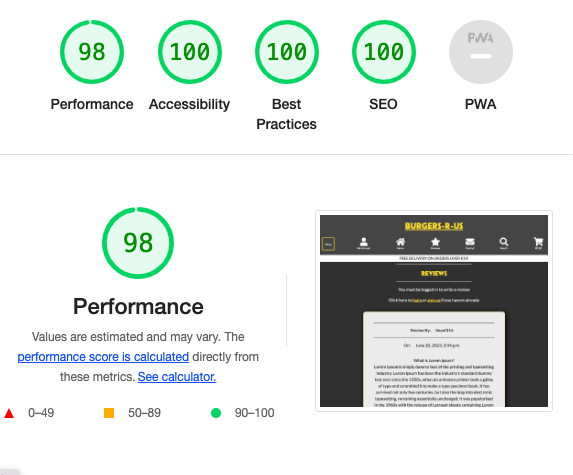

# **Burgers R-Us Testing**

## **Overview**
A wide range of testing was carried out during development including, Automated testing, manual testing, user story testing, code validation and bug testing.

[Back to README](/README.md)

## **User Story Testing**

Overall there were 55 completed user stories and 1 uncompleted user story throughout the projects development. They will all be tested below to ensure criteria has been met for each story. The users stories will be broken down into their respetive milestones to be tested.

### **EPIC: Django Installation and app setup**

#### 1. [**USER STORY: Create Superuser**](https://github.com/seanj06/Burgers-R-Us-P5/issues/1)

As a developer I can create a superuser so that i can manage my application from the admin panel.

This user story had a must-have label.

**Acceptance Criteria**

- 1.Superuser is created from command line with secure password.

  - The superuser was created at the beginning of development from the cli.

- 2.Login to admin panel to check superuser has been created 
    successfully.   
  -  After the superuser was created a check was made from the admin panel that the superuser could successfully login.

#### 2. [USER STORY: Install Django and relevant libraries](https://github.com/seanj06/Burgers-R-Us-P5/issues/2)   

As a developer I can install Django and all other relevant libraries so that development on my app can start.

This user story had a must-have label.

**Acceptance Criteria**

- 1.Django installed correctly from command line

  - Django was installed from cli at start of development

- 2.All other packages installed from command line

  - All other django related projects were also installed.

- 3.All packages freezed into requirements.txt file   

  -  All django related packages were pip freezed to requirements.txt file.

#### 3. [USER STORY: Create Django Project And App](https://github.com/seanj06/Burgers-R-Us-P5/issues/3)

As a developer I can create a new django project and app so that I can start development on my project

This user story had a must have label.

**Acceptance Criteria**

- 1.New django project created with appropriate name

  - New django project was created and named from the cli

- 2.New django app created with appropriate name

  - The home app was the first app created within the project.

- 3.New app added to installed apps in settings.py

  - After creation the home app was added to installed apps in settings.py.

[Top of page &uarr;](#contents)

### **EPIC: First Heroku Deployment** 

#### 4. [USER STORY: Create new Heroku app](https://github.com/seanj06/Burgers-R-Us-P5/issues/7)

As a developer I can create a new Heroku app so that my site can be deployed correctly.

This user story had a must have label.

**Acceptance Criteria**

- 1.New Heroku app created

  - A new app was created on Heroku to link to my project

- 2.Relevant config vars entered for deployment

  - All relevant config vars were added to heroku pre delployment including DATABASE_URL and SECRET_KEY.

- 3.Disable collect static initially set as a config var before was bucket is set up.

  - One the first deployment the disablecollect static config var was added.

- 4.Link github repo to heroku app

  - The projects github repo was linked to the heroku app in the deployment tab.

#### 5. [USER STORY: Static File Hosting](https://github.com/seanj06/Burgers-R-Us-P5/issues/8)

As a developer I can set up an aws bucket and link it to my deployed heroku app so that it serves the static files of my deployed app

This user story had a must-have label

**Acceptance Criteria**

- 1.Set up aws bucket and get secret keys

  - Secret keys were downloaded onto my machine after the aws bucket was setup

- 2.Add aws keys to heroku config vars

  - The aws secret key variables were added to my heroku app after the aws bucket was set up.

- 3.Remove disable collectstatic config vars

  - The disable collect static config var was removed and the site was deployed with aws static file hosting.

[Top of page &uarr;](#contents)

### **EPIC: Allauth Installation And Setup**

#### 6. [USER STORY: Email Verification](https://github.com/seanj06/Burgers-R-Us-P5/issues/6)

As a user I want to receive email verification so that my account is set up correctly

This user story had a should-have label

**Acceptance Criteria**

- 1.Set up backend email settings in settings.py

  - Email settings were set up in settings.py for both development and production.

- 2.Set up heroku config vars for email host and password

  - Heroku config vars were added to link to email backend setup.

#### 7. [USER STORY: Sign Up/Sign In/ Sign out](https://github.com/seanj06/Burgers-R-Us-P5/issues/5)

As a user I want to make an account and be able to sign in and out so that I can access all the features available to registered users

This user story had a must-have label

**Acceptance Criteria**

- 1.Users are able to sign in/out and sign up from the navbar

  - Sign in, sign out and register links are available to the user from the navbar.

- 2.All of the allauth templates match the rest of the site

  - All of the allauth templates have been custom styled to match the rest of the site.

#### 8. [USER STORY: Customise Allauth templates](https://github.com/seanj06/Burgers-R-Us-P5/issues/10)  

As a developer I can customise the alluth templates so that they match the theme of the rest of the site

This user story had a should-have label.

**Acceptance Criteria**

- 1.Allauth templates are imported into correct folder

  - Allauth templates were imported from the cli into the templates folder.

- 2.Templates match the theme of the rest of the site

  - All of the allauth templates have been custom styled to match the rest of the site.

#### 9. [USER STORY: Install Allauth](https://github.com/seanj06/Burgers-R-Us-P5/issues/4)

As a developer I can install allauth so that users can make an account and sign in

**Acceptance Criteria**

- 1.Allauth installed from command line

  - Allauth was installed from the cli at the start of development

- 2.Allauth added to installed apps in settings.py

  - Allauth was added to installed apps in settings.py

- 3.Alluth freeze to requirements.txt  

  - After allauth was installed it was added to the requirements.txt file.

[Top of page &uarr;](#contents)

### **EPIC: User Checkout**

#### 10. [USER STORY: Checkout Template](https://github.com/seanj06/Burgers-R-Us-P5/issues/27)

As a developer I can create a checkout template so that the user has a page to navigate to to checkout securely

This user story had a must-have label

**Acceptance Criteria**

- 1.Checkout page features checkout form which is linked to checkout model

  - Checkout form was added to the checkout page which links to the model.

- 2.User only able to submit form if all fields are valid

  - Form validation was added to form fields and users are shwon an error message if the form is invalid.

- 3.User form and checkout page matches rest of site

  - The checkout page was styled to match the rest of the site.

#### 11. [USER STORY: Checkout Form](https://github.com/seanj06/Burgers-R-Us-P5/issues/28)

As a developer I can create a custom user form so that users can securely checkout

This user story had a should-have label

**Acceptance Criteria**

- 1.Form has correct attributes attached

  - Custom widgets were added to the form in forms.py

- 2.All fields that are required are set to required

  - All required fields were set to required in both the model and forms.py

- 3.Form only valid on correct user input

  - Error handling was added for the form fields.

#### 12. [USER STORY: Checkout Models](https://github.com/seanj06/Burgers-R-Us-P5/issues/26)

As a developer I can create checkout database models so that the correct user information is saved in thee database upon checkout

This user story had a must-have label

**Acceptance Criteria**

- 1.All vital user information is saved in database model

  - All of the users personal and delivery info are included in the model fields.

- 2.Unique order number is included in model

  - A custom order generator was created to add a unique order number for every order.

- 3.Delivery information, and cost is saved in database

  - All user delivery information and delivery cost information are included in the model.

[Top of page &uarr;](#contents)

### **EPIC: User profile**

#### 13. [USER STORY: Order History](https://github.com/seanj06/Burgers-R-Us-P5/issues/35)

As a user I can view my order history from my profile so that I can view all my orders from one place

This user story had a should-have label

**Acceptance Criteria**

- 1.Users can view order history from profile page

  - Code was added to let users view their order history from the profile page

- 2.All order details are shown

  - All order history details are shown to the user including product info and costs.

#### 14. [USER STORY: Default form info](https://github.com/seanj06/Burgers-R-Us-P5/issues/36)

As a user I can have all of my default delivery information saved so that I can easily fill out delivery forms when needed

This user story had a could-have label.

**Acceptance Criteria**

- 1.Users can update their default info from profile page

  - Users are able to enter their default delivery info and save it from the profile page

- 2.Users can choose to save their info when checking out

  - When checking out users can click the save info box to save the delivery info for the next time.

#### 15. [USER STORY: Profile View](https://github.com/seanj06/Burgers-R-Us-P5/issues/34)

As a developer I can set up profile views so that the logic can be handled for the profile app

**Acceptance Criteria**

- 1.Home view is set up to render profile page

  - Profile view was set up to render profile template

- 2.Url is added for profile home view

  - Profile url was added to urls.py file

#### 16. [USER STORY: Profile Model](https://github.com/seanj06/Burgers-R-Us-P5/issues/33)

As a developer I can **create a profile model ** so that users can access their delivery and order information and history

This user story had a must-have label

**Acceptance Criteria**

- 1.Profile model is linked to User model

  - Profile model is linked to User model via a OneToOne field

- 2.Profile model is linked to Order model 

   - The Profile model is linked to the Order model via a ForeignKey

#### 17. [USER STORY: Profile app](https://github.com/seanj06/Burgers-R-Us-P5/issues/32)

As a developer I can create a profile app so that user profiles can be organised into their own models views and urls

This user story had a must-have label

**Acceptance Criteria**

- 1.Profile app created from terminal

  - The profile app was created from the terminal

- 2.Profile app is added to installed apps

  - After creation the profile app was added to installed apps in settings.py

- 3.Profile app added to main URL file

  - The profile app urls was added to the main urls.py file

[Top of page &uarr;](#contents)

### **EPIC: U/X**

#### 18. [USER STORY: Custom Error Pages](https://github.com/seanj06/Burgers-R-Us-P5/issues/49)

As a developer I can add custom error pages so that the error pages users see match the rest of the site

This user story had a must-have label

**Acceptance Criteria**

- 1.All error pages match the theme of the rest of the site

  - All custom error pages have been styled to match the rest of the site

- 2.All error pages show the user a home button to navigate back to the home page

  - All error pages include a home button for the users to return to the homepage.

#### 19. [USER STORY: Finish styling allauth pages](https://github.com/seanj06/Burgers-R-Us-P5/issues/47)

As a developer I can finish styling the allauth pages so that the pages match the theme of the rest of the site

This user story had a should-have label

**Acceptance Criteria**

- 1.All pages match the theme of the rest of the site

  - All allauth pages have been styled to match the rest of the site

- 2.All pages are responsive on all screen sizes and no content is blocked by page header

  - Appropriate padding and classes were added to ensure responsiveness

- 3.All correct user toast messages are shown

  - All pages were tested to ensure users are shown correct toasts.

#### 20. [USER STORY: Finish stying product pages](https://github.com/seanj06/Burgers-R-Us-P5/issues/48)

As a developer I can finish styling the product pages so that the pages match the rest of the site

This user story had a must-have label.

**Acceptance Criteria**

- 1.Product pages match the rest of the site

  - All product pages match the theme of the rest of the site

- 2.Pages are fully responsive on all screen sizes

  - Relevant media queries and bootstrap classed were added to ensure responsiveness.

- 3.Users are shown correct toast messages

  - All product pages were tested to ensure users were shown correct toast messages.

- 4.Only authorized users can access certain features

  - There is login required and user checks to ensure only authorized users can access certain features.

#### 21. [USER STORY: Finish styling home page](https://github.com/seanj06/Burgers-R-Us-P5/issues/45)

As a developer I can finish the styling on the home page so that the user has a good impression when entering the site

This user story had a should-have label

**Acceptance Criteria**

- 1.Footer is added to homepage

  - The footer was added to the homepage with social media links and copyright info.

- 2.Ensure all site links work

  - All the homepage links were tested to ensure there were no broken links.

- 3.Ensure site is fully responsive

  - Extra bootstrap classes and media queries were added to ensure full responsiveness

#### 22. [USER STORY: Finish styling cart page](https://github.com/seanj06/Burgers-R-Us-P5/issues/46)

As a developer I can finish styling the cart page so that it matches the rest of the site theme

This user story had a should-have label

**Acceptance Criteria**

- 1. Cart page is fully responsive on all screen sizes

  - Extra bootstrap classes and media queries were added to ensure full responsiveness

- 2.Page them matches rest of site

  - The cart page was styled to match the rest of the site

- 3.All page functionality works correctly

  - All update, remove and links were tested to ensure working functionality.

#### 23. [USER STORY: User Notifications](https://github.com/seanj06/Burgers-R-Us-P5/issues/25)

As a developer I can set up custom user notifications so that users can be notified when they perform an action

This user story had a must-have label

**Acceptance Criteria**

- 1.Users receive notifications when adding or removing item from cart

  - Users are shown a success toast when adding or removing items from their cart.

- 2.Users receive notifications when signing in or out

  - Users are shwon a success toast notifiying them if they are logged in or out.

[Top of page &uarr;](#contents)

### **EPIC: SEO**

#### 24.[USER STORY: Robots.txt file](https://github.com/seanj06/Burgers-R-Us-P5/issues/52)

As a developer I can create a robots.txt file so that the file can tell search engines where they are not allowed on the site

This user story had a must-have label

**Acceptance Criteria**

- 1.All restricted URLs are included in robots.txt file

  - All dissallowed urls were added to the file

- 2.robots.txt file is on top level of code

  - The robots.txt file was created in the root directory

#### 25. [USER STORY: XML sitemap](https://github.com/seanj06/Burgers-R-Us-P5/issues/51)

As a developer I can add a sitemap to my code so that it improves overall SEO optimization

This user story had a must-have label

**Acceptance Criteria**

- 1.Sitemap shows all site URLs correctly

  - The sitemap shows all of ths sites urls

- 2.Sitemap file is at top level

  - The sitemap file was created in the root directory

#### 26. [USER STORY: Seo implementation](https://github.com/seanj06/Burgers-R-Us-P5/issues/50)

As a developer I can implement seo into my code so that my site will be higher up the list on search engine algorithms

This user story had a must-have label

**Acceptance Criteria**

- 1.Head tag includes researched SEO tags

  - Researched key words were placed in the head tag of base.html

- 2.Semantic HTML tages include researched SEO tags

  - Keyword classed were added to html section elements throughout the site

[Top of page &uarr;](#contents)

### **EPIC: Home page creation**

#### 27. [USER STORY: Contact Form](https://github.com/seanj06/Burgers-R-Us-P5/issues/37)

As a user I can contact the restaurant so that I can let them know about any issues

This user story had a should-have label

**Acceptance Criteria**

 - 1.Users can access contact form from homepage

   - The contact form can be accessed from both the navbar and the contact section from the homepage.

- 2.Users can choose from select boxes to narrow down issue

  - There is an issue dropwdown menu for users to select from on the form

#### 28. [USER STORY: Home page styling](https://github.com/seanj06/Burgers-R-Us-P5/issues/18)

As a developer I can make the home page eye catching so that first time and returning users are drawn in

This user story had a must-have label

**Acceptance Criteria**

- 1.Navbar is easy for users to follow, links easy to find.

  - All of the navbar links have icons attached for easy user navigation

- 2.Hero image big enough to draw user attention

  - The hero image sits just below the navbar on the homepage and is the first thing the user sees upon entering the site.

- 3.About us section is short and descriptive

  - The about us section is placed over the hero image and is in bold white text to draw users attention.

- 4.Footer section contains media links and copyright info.

  - The footer contains copyright info and 4 social media links

#### 29. [USER STORY: Hero Image](https://github.com/seanj06/Burgers-R-Us-P5/issues/12)

As a developer I can add a hero image to the homepage so that the site looks appealing for visitors as soon as they enter the site

This user story had a must-have label

**Acceptance Criteria**

- 1.Image is correct size and responsive

  - The image is fully responsive on all screen sizes and does not overflow.

- 2.Image matches theme of site

  - The image has a reduced opacity and the text matches the theme of the site

- 3.Image has button which brings users to products page

  - The image contains an order now button which brings users to the products page.

#### 30. [USER STORY: Search functionality](https://github.com/seanj06/Burgers-R-Us-P5/issues/17)

As a developer I can add search functionality so that the user can search for the products they want

This user story had a should-have label

**Acceptance Criteria**

- 1.Users can search for any product keyword from search bar in home page

  - Users can search for product keywords, categories or sub categories in the search bar 

- 2.Users are given feedback on whether a product is found or not

  - Search results are returned letting users know how many products were found in their search.

#### 31. [USER STORY: Navbar creation](https://github.com/seanj06/Burgers-R-Us-P5/issues/11)

As a developer I can create a navbar so that users can navigate the site easily

This user story had a must-have label

**Acceptance Criteria**

- 1.Navbar file is in correct includes folder

  - The navbar is split into 2 files in the includes folder. Main nav and mobile top header

- 2.Navbar contains links to all pages on the site

  - The navbar contains full site navigation and changes depending on the users logged in or out status.

- 3.What user is shown differs depending on if they are logged in or not.

  - The navbar links change depending on if a user is logged in or not.

[Top of page &uarr;](#contents)

### **EPIC: Product Page**

#### 32. [USER STORY: Product page creation](https://github.com/seanj06/Burgers-R-Us-P5/issues/19)

As a developer I can create a products page so that users can search the site for all available products

This user story had a must-have label

**Acceptance Criteria**

- 1.Users can access products page from navbar and homepage

  - The products page is accessible from both the navbar and the order now buton on the homepage

- 2.Users can see all available products

  - Users can select the all products link which will show them all of the site products.

#### 33. [USER STORY: Sort Food Products](https://github.com/seanj06/Burgers-R-Us-P5/issues/24)

As a user I can choose which way I sort food products so that I can find items easier

**Acceptance Criteria**

- 1.Users Can sort products by price, category and sub category

  - Users have the choice to sort products in various different ways.

- 2.Users can access sort feature from navbar

  - The sort feature is accessible from the main nav section of the navbar

#### 34. [USER STORY: Filter Product By Category](https://github.com/seanj06/Burgers-R-Us-P5/issues/23)

As a user I can filter products by category so that I can narrow my search down to the food products I am looking for

**Acceptance Criteria**

- 1.Users can filter product search by all categories

  - Users have the option to filter products by category aswell as various other options.

- 2.Users can access filter search from the navbar

  - Users can filter search from the products section in the navbar

#### 35. [USER STORY: Individual Product Details](https://github.com/seanj06/Burgers-R-Us-P5/issues/21)

As a customer I can view info about an individual product so that I can make a decision on which product I want to purchase

**Acceptance Criteria**

- 1.Users able to see product image, price, and description

  - Users are able to view all of the product details on the product card.

#### 36. [USER STORY: View Products](https://github.com/seanj06/Burgers-R-Us-P5/issues/20)

As a customer I can view all food products available so that I can choose what I want to purchase

**Acceptance Criteria**

- 1.Users can navigate to products page from home page and navbar

  - Users are able to navigate to the products page from both the homepage and navbar

- 2.Users can view all products from the products page

  - Users can view paginated pages of all products from the products page

[Top of page &uarr;](#contents)

### **EPIC: Crud Functionality**

#### 37. [USER STORY: View Items in cart](https://github.com/seanj06/Burgers-R-Us-P5/issues/16)

As a user want to view the items in my cart so that I can view the items I wish to purchase

This user story had a must-have label

**Acceptance Criteria**

- 1.Users can view items in their cart by going to cart page

  - Users are able to view every item currently in their cart from the cart page.

- 2.Only current user can see their own cart items and cannot access other users carts.

  - User checks are in place to ensure only the current user can view their cart

#### 38. [USER STORY: Remove item from cart](https://github.com/seanj06/Burgers-R-Us-P5/issues/14)

As a user I want to be able to remove items from my cart so that I can remove any unwanted items

This user story had a must-have label

**Acceptance Criteria**

- 1.User is able to remove any added items in cart

  - Users can remove items in their cart from the cart page by pressing the remove button

- 2.User is redirected back to their cart after deletion

  - After reload the user is redirected back to their cart

- 3.User is shown success message with item that was deleted

  - After deletion the user is shown a success toast.

#### 39. [USER STORY: Edit quantity in cart](https://github.com/seanj06/Burgers-R-Us-P5/issues/15)

As a user I want to be able to edit the quantity of items in my cart ** so that I can change the quantity of items I wish to purchase

This user story had a should-have label

**Acceptance Criteria**

- 1.User is able to edit quantity of items from cart

  - Users can edit the quantity of an item in their cart by pressing the edit button

- 2.User is shown success message with item edited

  - User is shown a success toast after edit.

- 3.User is redirected back to cart after edit.

  - The user is redirected back to the cart after edit

#### 40. [USER STORY: Add Product To Cart](https://github.com/seanj06/Burgers-R-Us-P5/issues/13)

As a user I want to be able to add food items to my cart so that I can see the items I am ordering

This user story had a must-have label

**Acceptance Criteria**

- 1.User can add product to cart by clicking on product from product page

  - Users can add a product to their cart by clicking the add to cart button

- 2.User can view all items in cart before checkout

  - The user is shown all items in their cart in the cart page before checkout

[Top of page &uarr;](#contents)

#### 41. [USER STORY: Delete Products](https://github.com/seanj06/Burgers-R-Us-P5/issues/44)

As a superuser I can delete site products so that any unavailable products can be removed from the site

This user story had a should-have label

**Acceptance Criteria**

- 1.Only superusers have access to delete products

  - Only supersusers can delete products. All other users will be redirected to a 403 action forbidden page.

#### 42. [USER STORY: Edit Product](https://github.com/seanj06/Burgers-R-Us-P5/issues/43)

As a superuser I can edit site products so that products can be modified if a mistake is made or a price changes

This user story had a should-have label

**Acceptance Criteria**

- 1.Only superusers have access to edit products

  - Only supersusers can edit products. All other users will be redirected to a 403 action forbidden page.

#### 43. [USER STORY: Add Products to site](https://github.com/seanj06/Burgers-R-Us-P5/issues/42)

As a staff member I can add products to the site so that the site is keep updated with the latest products

This user story had a should-have label

**Acceptance Criteria**

- 1.Form is linked to Food Model

  - The add product form is linked to the Food model

- 2.View and template code is added to ensure only superusers have access to form

  - Code is added to ensure only superusers have access to add products

[Top of page &uarr;](#contents)

#### 44. [USER STORY: Delete Review](https://github.com/seanj06/Burgers-R-Us-P5/issues/41)

As a user I can delete any reviews I have written so that I can remove it if i no longer feel the same about what i have written

This user story had a should-have label

**Acceptance Criteria**

- 1.Users can delete reviews from a button located underneath the review

  - Authors of the review can delete their own review with the delete button.

- 2.Only the author of the review can delete the review

  - Code was added to ensure only authors can delete own review. All other users will be redirected to 403 page

#### 45. [USER STORY: Update Review](https://github.com/seanj06/Burgers-R-Us-P5/issues/40)

As a user I can update any reviews I have written so that I can fix any mistakes I mad while writing it

This user story had a should-have label

**Acceptance Criteria**

- 1.Users can update their review by clicking on a button located on the review

  - Users are able to edit their review by clicking the review button

- 2.Only the review author can access and update the review

  - Code was added to ensure only authors can edit own review. All other users will be redirected to 403 page

#### 46. [USER STORY: Read A Review](https://github.com/seanj06/Burgers-R-Us-P5/issues/39)

As a user I can read reviews other users have written so that I can make a decision on what food to order

This user story had a should-have label

**Acceptance Criteria**

- 1.Users can access review page from homepage

  - Users can access the review page from both the navbar and the review section on the homepage

- 2.Users can read reviews regardless of being signed in or not

  - All users have access of the homepage whether they are signed in or not

- 3.Users can like reviews

  - Users can like reviews providing they are logged in

#### 47. [USER STORY: Create a review](https://github.com/seanj06/Burgers-R-Us-P5/issues/38)

As a user I can create a review so that I can share my thoughts on my food order

This user story had a should-have label

**Acceptance Criteria**

- 1.Users can access review page from homepage

  - Users can access the review page from both the navbar and the review section on the homepage

- 2.Users can only write a review if logged in

  - Users must be logged in to write a review.

- 3.Users can rate restaurant from 1 to 5 stars

  - When writing a review users can select 1 to 5 from a rating dropdown

[Top of page &uarr;](#contents)

### **EPIC: Stripe Setup**

#### 48. [USER STORY: Checkout Success](https://github.com/seanj06/Burgers-R-Us-P5/issues/30)

As a developer I can write code that lets users checkout successfully so that the checkout process functions correctly

This user story had a must-have label

**Acceptance Criteria**

- 1.Users are given the option to save their order to their profile.

  - All orders are saved to the users profile after successful checkout

- 2.Users are given success message on successful checkout

  - Users are shown a success toast with their order number on successful checkout

- 3.An email is sent to users with order number and delivery time

  - Users receive an email with all of their order details to their inputted email address on successful checkout

#### 49. [USER STORY: Render Stripe Field To Template](https://github.com/seanj06/Burgers-R-Us-P5/issues/29)

As a developer I can render a stripe field on any relevant templates so that users have a way to checkout using a payment method with stripe

This user story had a must-have label

**Acceptance Criteria**

- 1.Users are shown stripe field on the checkout view

  - The stripe payment field is rendered at the bottom of the checkout form

- 2.Secret Api key does not get into production commit

  - The secret keys were used as enviroment variables so were not commited into production

#### 50. [USER STORY: Heroku stripe setup](https://github.com/seanj06/Burgers-R-Us-P5/issues/9)

As a developer I can link my stripe account to heroku so that all of the stripe features work correctly on my deployed app

This user story had a must-have label

**Acceptance Criteria**

- 1.Ensure all stripe features work correctly on deployed site

  - Both stripe webhooks and payments were tested on both the production database and stripe test account.

#### 51. [USER STORY: Webhooks](https://github.com/seanj06/Burgers-R-Us-P5/issues/31)

As a developer I can set up webhooks so that I can ensure an order is created in the database even if a problem occurs while the user is making an order.

This user story had a could-have label

**Acceptance Criteria**

- 1.Webhook class contains payment intent succeeded method

  - Payment intent succeeded is included in the webhook

- 2.Webhook class contains payment fail method

  - Payment fail method is included in the webhook

- 3.Webhooks tested to ensure functionality

  - Webhooks were tested on both the terminal and stripe

[Top of page &uarr;](#contents)

### **EPIC: Testing**

#### 52. [USER STORY: Python Automated testing](https://github.com/seanj06/Burgers-R-Us-P5/issues/53)

As a developer I can write automated tests so that I can ensure my code functions correctly

This user story had a must-have label

**Acceptance Criteria**

- 1.All files in apps are tested

  - An attempt was made to test all files in all apps

- 2.At least 75% overall coverage between all apps

  - Total coverage for all apps was 90%

#### 53. [USER STORY: Python manual testing](https://github.com/seanj06/Burgers-R-Us-P5/issues/54)

As a developer I can manually test the code that want covered in automated testing so that all of my code is tested in some way

This user story had a should-have label

**Acceptance Criteria**

- 1.All python code is manually tested that wasn't covered in automated testing

  - All code that was missed in the automated testing was manually tested.

#### 54. [USER STORY: Code validation](https://github.com/seanj06/Burgers-R-Us-P5/issues/55)

As a developer I can validate my code so that it passes through code validators and follows best practices

This user story had a must-have label

**Acceptance Criteria**

- 1.All HTML code passes validation

  - All html was passed through the w3c validator and passed with no errors.

- 2.All CSS code passes validation

  - All css code was passed through the jigsaw validator and passed with no errors

- 3.All python code passes validation

  - All python code was passed through the pep8 validatior and passed with no errors

- 4.All javascript code passes validation

  - All javascript code was passed through the jshint validator and passed with no errors

#### 55. [USER STORY: Lighthouse testing](https://github.com/seanj06/Burgers-R-Us-P5/issues/56)

As a developer I can test my site on the lighthouse chrome extension so that I can ensure it has good performance, SEO and accessibility

This user story had a must-have label

**Acceptance Criteria**

- 1.All site pages have a high SEO, accessibility and performance rating

  - All pages passed lighthouse validation with high scores all round

- 2.All site pages are tested through both mobile and desktop

  - Both desktop and mobile results were tested and are available to view from the lighthouse testing section.

[Top of page &uarr;](#contents)

### **Backlog(Unfinished User Stories)**

#### 56. [As a customer I can view all special offers so that I can take advantage of any deals](https://github.com/seanj06/Burgers-R-Us-P5/issues/22)

This user story had a wont-have label

This user story was not completed due to time constraints but would be the first future feature added when time allows as I think
this would add a lot of value to the site.

**Acceptance Criteria**

- 1.Users can navigate to special offers page from the homepage and products page

  - This acceptance criteria was not completed due to time constraints

- 2.Special offers page shows users all deals

  - This acceptance criteria was not completed due to time constraints

## **Validation**

### **Python Code Validation**

The [CI Python Linter](https://pep8ci.herokuapp.com/) was used to validate Python code used throughout the project.

#### **Home App**

#### **Cart App**

#### **Checkout App**

#### **Contact App**

#### **Product App**

#### **Profile App**

#### **Review App**

### **Javascript Jshint Validation**

All javascript code was run through the jshint validator. Only 1 error was returned on the stripe_element.js file. "1 undefined variable : stripe". As this code links directly to the stripe element and is from the documentation I am unsure of how to fix it at this time.

#### **Cart App**

No errors were returned in testing the cart app

**cart.js file**

**cart template js**

#### **Checkout App**

As mentioned above 1 error was found in testing the javascript on this app. "1 undefined variable : stripe"

**stripe_element.js file**

#### **Products App**

No errors were returned in testing the products app

**products.js file**

**edit and add product template js**

#### **Review App**

No errors were returned in testing the review app

**review template js**

### **Css Jigsaw Validation**

All Css files were run through the jigsaw validator. No errors were found.

base.css

checkout.css

products.css

products.css

### **HTML W3 validation**

Because of the django templating language html files could not be testing file by file through the W3 validator, rather they had to be tested by page source code. I tested the html by right clicking on the page, navigating to view page source and manually entering the html into the validator.

#### **HTML Pages No Errors**

Checkout Page

Checkout Success Page

Sign-Up Page

Add Review Page

Cart Page

Contact Page

Home Page

Product Detail Page

Products Page

Profile Page

Sign-In Page

Sign-Out Page

#### **HTML Errors**

When validating my html I ran into errors on 2 different pages. The review page and the add+edit product pages.

**Review Errors**

The validator returned 2 errors about extra p tags being generated, however on inspecting the code there were no extra p tags. I concluded that this must be due to the templating language so is unfixable at this time.

**Edit + Add Product Page Errors**

The validator returned duplicate class errors on this page on the "contains" select dropdown box elements. Since this is a multiselect field and multiple choices are generated which need to have the same class this error is unfixable at this time.

### **Lighthouse Testing**

Lighthouse testing was done done through the chrome devtools by right clicking on the site page, navigation to inspect, then navigating to lighthouse report.
I gathered reports for both desktop and mobile devices.

#### **Home Page Lighthouse**

Home Page Desktop

Home Page Mobile

#### **Product Page Lighthouse**

Product Page Desktop

Product Page Mobile

#### **Product Detail Page Lighthouse**

Product Detail Page Desktop

Product Detail Page Mobile

#### **Edit Product Page Lighthouse**

Edit Product Page Desktop

Edit Product Page Mobile

#### **Add Product Page Lighthouse**

Add Product Page Desktop

Add Product Page Mobile

#### **Review Page Lighthouse**

Review Page Desktop

Review Page Mobile

#### **Edit Review Page Lighthouse**

Edit Review Page Desktop

Edit Review Page Mobile

#### **Contact Page Lighthouse**

Contact Page Desktop

Contact Page Mobile

#### **Cart Page Lighthouse**

Cart Page Desktop

Cart Page Mobile

#### **Checkout Page Lighthouse**

Checkout Page Desktop

Checkout Page Mobile

#### **Checkout Success Page Lighthouse**

Checkout Success Page Desktop

Checkout Success Page Mobile

#### **Profile Page Lighthouse**

Profile Page Desktop

Profile Page Mobile

#### **Sign Up Page Lighthouse**

Sign-Up Page Desktop

Sign-Up Page Mobile

#### **Sign In Page Lighthouse**

Sign-In Page Desktop

Sign-In Page Desktop

#### **Sign Out Page Lighthouse**

Sign-Out Page Desktop

Sign-Out Page Mobile

### **Lighthouse Errors**

#### **Mobile Performance Ratings**

All mobile lighthouse performance ratings were severely effected by render blocking recources such as aws, stripe, jquery and bootstrap. 
After some research I am unsure why this is happening on just mobile and am unable to fix the issue at this time.

#### **Cart Page SEO**

The cart page SEO rating was affected by a "links not crawlable" error.This is due to the cart page being included in the disallow section of the robots.txt file.

   

